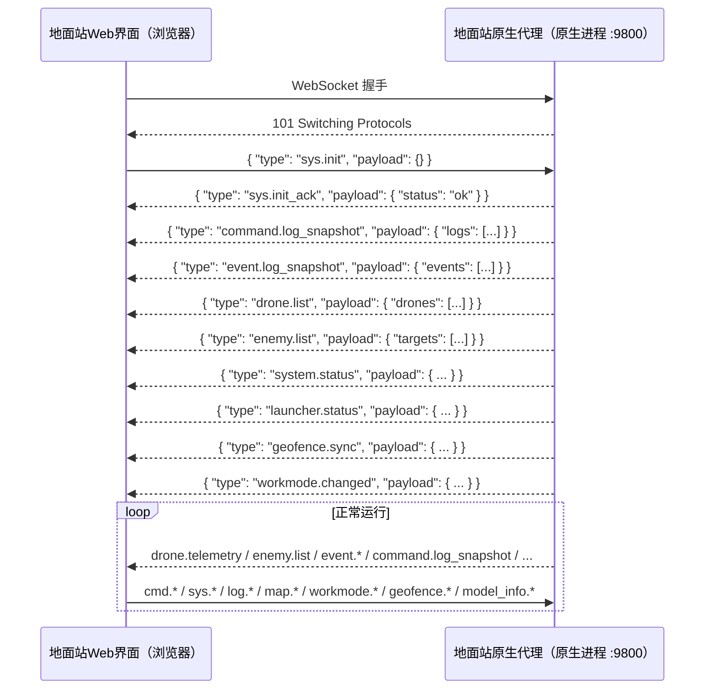
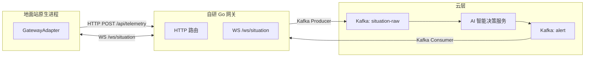
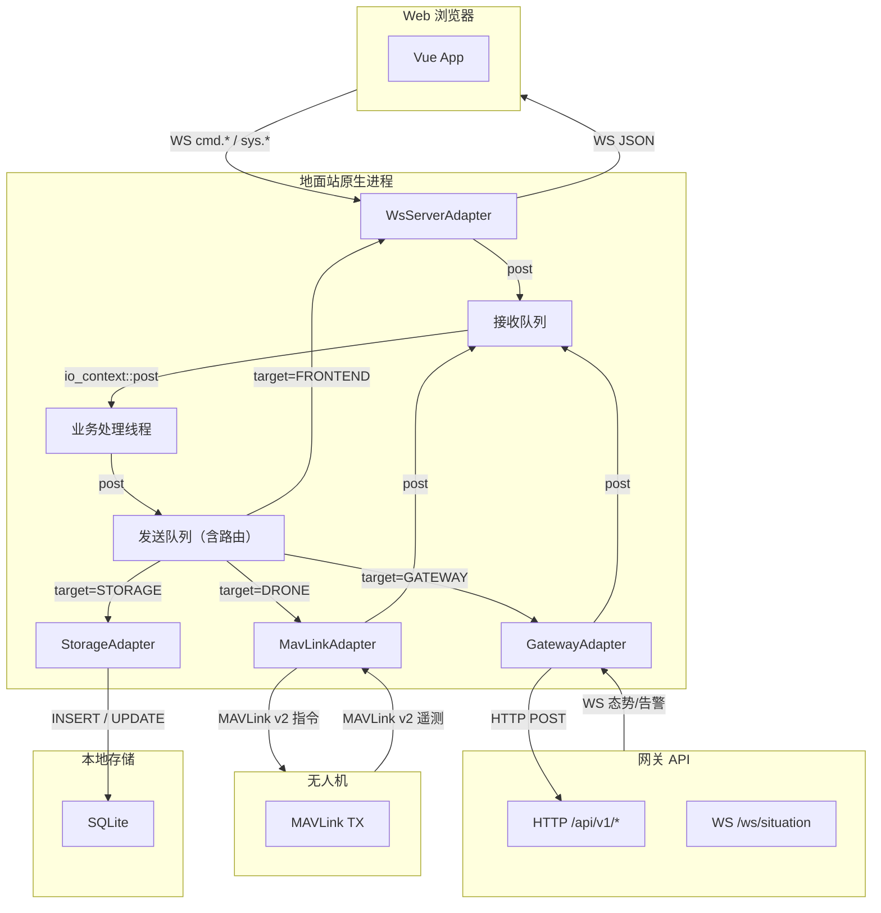

# 蜂巢智控 · 接口协议设计文档

> **文档说明**：本文档定义蜂巢智控系统三条核心链路的接口协议：地面站↔无人机（MAVLink v2）、地面站原生进程↔Web浏览器（WebSocket JSON）、地面站↔网关API（HTTP/WebSocket）。
>
> **上游依据**：
> - [蜂巢智控架构设计 v1.3](./蜂巢智控架构设计.md) — 通信协议矩阵 + 故障诊断 + 仿真集成 + 时间同步
> - [蜂巢智控-端侧-地面站详细设计 v2.4](./蜂巢智控-端侧-地面站详细设计.md) — 交互场景与处理流程
> - [SWARM-COM 地面站软件 v1.2 需求文档](./SWARM-COM_地面站软件_需求文档.md) — 功能需求基线

---

## 文档版本控制

| 版本 | 日期 | 作者 | 变更说明 | 评审状态 |
|:---|:---|:---|:---|:---:|
| v1.7 | 2026-06-16 | 冯浩恒 | `HK_AI_STATUS` 拆分为飞行控制 AI 与跟踪算法 AI 双模块状态：分别携带 modelName、version、status、faultCode、responseTime；GPU 信息保持共用；同步更新 WebSocket `aiModule` 结构 | 待评审 |
| v1.6 | 2026-06-09 | 冯浩恒 | MAVLink COMMAND_LONG 序列号位置调整：`seqNum` 从 `param1` 移至 `confirmation` 字段，释放 `param1` 给各指令类型的实际参数（GimbalControl 的 pitch、CameraSwitch 的 camera_id、BehaviorConfig 的 behavior 等）；ACK 仍通过 `result_param2` 回传 seqNum | 待评审 |
| v1.5 | 2026-06-09 | 冯浩恒 | 指令状态推送机制重构：`command.status`（增量单条）废弃，统一改为 `command.log_snapshot`（全量快照，事件触发）；MAVLink COMMAND_LONG `confirmation` 携带发送序列号，ACK 通过 `result_param2` 反查 CMDID；前端下发指令 payload 新增 `commandIds` 字段；指令覆盖逻辑改为"同无人机所有 Pending 旧指令标记为 Interrupted" | 待评审 |
| v1.4 | 2026-06-02 | 冯浩恒 | 对齐详细设计 v3.0：AIDecisionEvent 新增 source 字段（SUPERIOR/AI_AUTONOMOUS）、GeoFenceZone 新增 restrictionType 预留字段、告警等级着色补全"提示"级别、威胁等级边界修正为 3~5km、移除 MAVLink 中 FENCE_STATUS/FENCE_ACK（电子围栏走 WS+HTTP 链路）、新增 §3.3.8 规则配置同步 HTTP 端点 | 待评审 |
| v1.3 | 2026-06-02 | 冯浩恒 | 对齐架构设计 v1.3：新增 §3.3.8 网关授时接口(GET /api/v1/time)、补充 MAVLink SYSTEM_TIME 广播说明 + GPS NMEA 授时协议 | 待评审 |
| v1.2 | 2026-06-02 | 冯浩恒 | 对齐架构设计 v1.2：新增诊断事件消息(diagnostic.event)、仿真集成接口(POST /api/v1/external/simulation + X-Simulation-Key)、enemy_update 仿真数据 signature 标识、StationHealth 数据来源更新、system.status 仿真模式标记 | 待评审 |
| v1.1 | 2026-06-02 | 冯浩恒 | 对齐详细设计 v2.2 + 需求 v1.2：新增发射箱指令(43001/43002)、发射箱遥测(50004/50005/50006)、v1.2 WS 消息类型（launcher.status / workmode.changed / geofence.* / model_info.* / tactical.intercept_result）、事件弹窗三类告警消息、Gateway own_update 主题、附录映射表补充 | 待评审 |
| v1.0 | 2026-05-27 | 冯浩恒 | 初始版本：三条链路接口协议基线 | 已归档 |

---

## 目录

1. [协议一：地面站 ↔ 无人机（MAVLink v2）](#1-协议一地面站--无人机mavlink-v2)
2. [协议二：地面站 ↔ 发射箱（MAVLink v2）](#2-协议二地面站--发射箱mavlink-v2)
3. [协议三：地面站 GNSS 位置（MAVLink v2）](#3-协议三地面站-gnss-位置mavlink-v2)
4. [协议四：地面站原生进程 ↔ Web 浏览器（WebSocket JSON）](#4-协议四地面站原生进程--web-浏览器websocket-json)
5. [协议五：地面站 ↔ 网关 API（HTTP / WebSocket）](#5-协议五地面站--网关-apihttp--websocket)
6. [消息路由总图](#6-消息路由总图)
7. [大模型交互接口（预留）](#7-大模型交互接口预留)
8. [安全机制](#8-安全机制)
9. [数据模型接口定义](#9-数据模型接口定义)

---

## 1. 协议一：地面站 ↔ 无人机（MAVLink v2）

### 1.1 概述

| 项目 | 说明 |
|:---|:---|
| **协议** | MAVLink v2 |
| **物理层** | 串口（RS232/422）/ USB CDC ACM / UDP（SITL 仿真） |
| **波特率** | 默认 57600 bps，可配置 |
| **MAVLink 组件 ID** | 地面站 = `MAV_COMP_ID_MISSIONPLANNER` (190)；无人机 = `MAV_COMP_ID_AUTOPILOT1` (1) |
| **系统 ID** | 地面站 = 255；无人机 = 1~254（按编号分配） |
| **心跳间隔** | 1 Hz，超时判定 5s |

### 1.2 遥测消息

#### 1.2.1 HEARTBEAT（心跳） （无人机 → 地面站） `MSG_ID: 0`，频率 1 Hz 

| 字段 | 类型 | 值 | 说明 |
|:---|:---|:---|:---|
| `type` | `uint8_t` | `MAV_TYPE_QUADROTOR` (2) | 无人机类型 |
| `autopilot` | `uint8_t` | `MAV_AUTOPILOT_PX4` (12) | 自驾仪类型 |
| `base_mode` | `uint8_t` | — | 基础模式位掩码 |
| `custom_mode` | `uint32_t` | — | 自定义模式 |
| `system_status` | `uint8_t` | — | 系统状态：`MAV_STATE_ACTIVE` (4) 等 |

地面站根据心跳存活和丢包率综合判定连接状态。

#### 1.2.2 GLOBAL_POSITION_INT（全局位置） （无人机 → 地面站） `MSG_ID: 33`，频率 5~10 Hz 

| 字段 | 类型 | 单位 | 精度 | 设计映射 |
|:---|:---|:---|:---|:---|
| `lat` | `int32_t` | 度 × 10^7 | 7位小数（显示6位） | `FlightState.position.lat` |
| `lon` | `int32_t` | 度 × 10^7 | 7位小数（显示6位） | `FlightState.position.lng` |
| `alt` | `int32_t` | mm | 显示取 m 个位 | `FlightState.altitude` |
| `relative_alt` | `int32_t` | mm | 显示取 m 个位 | `FlightState.agl` |
| `vx` `vy` `vz` | `int16_t` | cm/s | 显示取 m/s 个位 | `FlightState.speed`（合成后） |
| `hdg` | `uint16_t` | 厘度 | 显示取 ° 个位 | `FlightState.heading` |

#### 1.2.3 BATTERY_STATUS（电池状态） （无人机 → 地面站） `MSG_ID: 147`，频率 1 Hz 

| 字段 | 类型 | 设计映射 |
|:---|:---|:---|
| `battery_remaining` | `int8_t` | `Drone.batteryPercent`（取绝对值） |

#### 1.2.4 SYS_STATUS（系统状态）（无人机 → 地面站） `MSG_ID: 1`，频率 1 Hz 

| 字段 | 类型 | 设计映射 |
|:---|:---|:---|
| `onboard_control_sensors_present` | `uint32_t` | 位掩码，判定各传感器是否存在 |
| `onboard_control_sensors_health` | `uint32_t` | 位掩码，0=正常。对应 `SensorSet` 各字段 |
| `load` | `int16_t` | 对应电机/推力负载 |
| `voltage_battery` | `uint16_t` | 辅助电压参考 |

**传感器健康位映射**：

| 位 | 传感器 | 设计映射 | 优先级 |
|:---|:---|:---|:---:|
| 0 | 3D 陀螺仪 (IMU) | `SensorSet.imuNormal` | P1 |
| 1 | 3D 加速度计 (IMU) | `SensorSet.imuNormal` | P1 |
| 10 | 摄像头 | `SensorSet.cameraNormal` | P1 |
| 11 | 空速管 | `SensorSet.pitotNormal` | P2 |
| 12 | 气压计 | `SensorSet.barometerNormal` | P2 |

#### 1.2.5 GPS_RAW_INT（GPS 原始数据） （无人机 → 地面站） `MSG_ID: 24`，频率 2~5 Hz 

| 字段 | 类型 | 设计映射 |
|:---|:---|:---|
| `satellites_visible` | `uint8_t` | `GpsReceiver.satelliteCount` |
| `eph` | `uint16_t` | 水平精度因子，转换为 `GpsReceiver.hdop`（cm → 无单位，除以100） |

#### 1.2.6 ATTITUDE（姿态角） （无人机 → 地面站） `MSG_ID: 30`，频率 5 Hz 

| 字段 | 类型 | 单位 | 精度 | 设计映射 |
|:---|:---|:---|:---|:---|
| `roll` | `float` | rad | 显示取 ° 个位 | `FlightState.roll` |
| `pitch` | `float` | rad | 显示取 ° 个位 | `FlightState.pitch` |
| `yaw` | `float` | rad | 显示取 ° 个位 | `FlightState.yaw` |

> 注：`roll`/`pitch`/`yaw` 在 MAVLink 消息中为弧度（rad），地面站接收后转换为角度（°）显示。

#### 1.2.7 HK_AI_STATUS 机载 AI 状态 （无人机 → 地面站） `MSG_ID: 50000`（自定义），频率 1 Hz `v1.7 更新`

> 发送方无人机 SYSID 由 MAVLink 帧头 `sysid` 标识，payload 中不重复携带。本消息同时携带飞行控制 AI 与跟踪算法 AI 的状态，GPU 信息为两者共用。

| 字段 | 类型 | 设计映射 |
|:---|:---|:---|
| `fc_model_name` | `char[20]` | `AIModule.flightControl.modelName` |
| `fc_version` | `char[10]` | `AIModule.flightControl.version` |
| `fc_status` | `uint8_t` | 0=正常, 1=故障 → `AIModule.flightControl.isNormal` |
| `fc_fault_code` | `uint16_t` | `AIModule.flightControl.faultCode`（正常时 0） |
| `fc_response_time` | `uint16_t` | `AIModule.flightControl.responseTime`（ms） |
| `track_model_name` | `char[20]` | `AIModule.tracking.modelName` |
| `track_version` | `char[10]` | `AIModule.tracking.version` |
| `track_status` | `uint8_t` | 0=正常, 1=故障 → `AIModule.tracking.isNormal` |
| `track_fault_code` | `uint16_t` | `AIModule.tracking.faultCode`（正常时 0） |
| `track_response_time` | `uint16_t` | `AIModule.tracking.responseTime`（ms） |
| `gpu_usage` | `uint8_t` | `AIModule.gpuUsage`（%） |
| `gpu_temperature` | `int8_t` | `AIModule.gpuTemperature`（°C） |

#### 1.2.8 HK_MOTOR_STATUS 电机状态 （无人机 → 地面站） `MSG_ID: 50001`（自定义），频率 1 Hz 

| 字段 | 类型 | 设计映射 |
|:---|:---|:---|
| `motor_index` | `uint8_t` | `Motor.index` |
| `motor_rpm` | `uint16_t` | `Motor.rpm` |
| `motor_temperature` | `int8_t` | `Motor.temperature`（°C） |
| `motor_thrust` | `uint8_t` | `Motor.thrustOutput`（%） |
| `motor_status` | `uint8_t` | 0=正常, 1=故障 → `Motor.isNormal` |

注：每条消息携带一个电机的数据，多电机需多条消息或使用数组扩展。

#### 1.2.9 HK_IMPACT_CONFIRM 撞击确认消息（无人机 → 地面站）`MSG_ID: 50002`（自定义），事件触发 `【P3】` 

当无人机撞击目标发生后，无人机上报撞击确认消息。地面站据此创建 `InterceptRecord`。

| 字段 | 类型 | 设计映射 |
|:---|:---|:---|
| `target_id` | `uint8_t` | `InterceptRecord.targetName`（通过 ID 反查） |
| `target_speed` | `int16_t` | cm/s → 取 m/s → `InterceptRecord.targetSpeed` |
| `drone_speed` | `int16_t` | cm/s → 取 m/s → `InterceptRecord.droneSpeed` |
| `impact_lat` | `int32_t` | 度 × 10^7 → `InterceptRecord.impactPosition.lat` |
| `impact_lon` | `int32_t` | 度 × 10^7 → `InterceptRecord.impactPosition.lng` |
| `impact_alt` | `int32_t` | mm → m → `InterceptRecord.impactAltitude` |
| `kill_level` | `uint8_t` | 0=摧毁, 1=重创, 2=轻伤 → `KillLevel` |

注：`distanceToStation`、`groundOffset`、`errorProbability`、`perDroneKillProb` 由地面站本地计算/配置填充。

#### 1.2.9 HK_TARGET_SITUATION 目标态势信息（地面站 → 无人机）`MSG_ID: 50003`（自定义），频率 1 Hz `【P1】` `v1.4 新增` 

地面站向指定无人机下发目标态势信息（位置），用于引导无人机飞向目标。

`target_sysid` 字段标识该消息的目标接收无人机。

| 字段 | 类型 | 设计映射 |
|:---|:---|:---|
| `target_sysid` | `uint8_t` | 目标无人机系统 ID（消息接收方） |
| `target_lat` | `int32_t` | 度 × 10^7 → 目标纬度 |
| `target_lon` | `int32_t` | 度 × 10^7 → 目标经度 |
| `target_alt` | `int32_t` | mm → m → 目标海拔高度 |
| `speed_north` | `int32_t` | 北向速度（单位 cm/s） |
| `speed_east` | `int32_t` | 东向速度（单位 cm/s） |
| `speed_down` | `int32_t` | 地向速度（单位 cm/s） |
| `lat_std` | `int16_t` | 纬度标准差（单位：0.01°，即 1 表示 0.01°） |
| `lon_std` | `int16_t` | 经度标准差（单位：0.01°，即 1 表示 0.01°） |
| `alt_std` | `int16_t` | 高度标准差（单位：0.1 m，即 1 表示 0.1 m） |
| `ned_speed_north_std` | `int16_t` | 北向速度标准差（单位：cm/s） |
| `ned_speed_east_std` | `int16_t` | 东向速度标准差（单位：cm/s） |
| `ned_speed_down_std` | `int16_t` | 地向速度标准差（单位：cm/s） |
| `validity_mask` | `uint8_t` | 字段有效性掩码：<br>bit 0 = 位置有效（lat/lon/alt）<br>bit 1 = 位置标准差有效（lat_std/lon_std/alt_std）<br>bit 2 = 速度有效（speed_north/speed_east/speed_down）<br>bit 3 = 速度标准差有效（*_std） |

### 1.3 指令消息

> **目标无人机标识**：所有指令通过 `COMMAND_LONG`（MSG_ID: 76）或 `COMMAND_INT`（MSG_ID: 75）下发。帧头 `target_system` 字段指定目标无人机 SYSID，`target_component` 字段指定目标组件（通常为 `MAV_COMP_ID_AUTOPILOT1`=1）。下表中不再逐条重复标注。
 
#### 1.3.1 基础飞行指令 （地面站 → 无人机）

| MAV_CMD | 指令 | 参数 | 说明 |
|:---|:---|:---|:---|
| `MAV_CMD_NAV_TAKEOFF` (22) | 起飞 | `param5`=lat×10^7, `param6`=lon×10^7, `param7`=alt(m) | 目标高度为离地高度（设计补充：需求未指定起飞高度，此处预留高度参数供未来按需使用）；经纬度为 int32 格式（度×10^7） |
| `MAV_CMD_NAV_LAND` (21) | 降落 | — | 原地降落 |
| `MAV_CMD_NAV_RETURN_TO_LAUNCH` (20) | 返航 | — | 飞回发射点 |
| `MAV_CMD_NAV_LOITER_UNLIM` (17) | 悬停 | — | 当前位置保持悬停 |
| `MAV_CMD_NAV_WAYPOINT` (16) | 飞至坐标 | `param5`=lat×10^7, `param6`=lon×10^7, `param7`=alt(m) | 需求指定为离地高度；MAVLink 标准中 `MAV_CMD_NAV_WAYPOINT` 的 param7 为 AMSL（海拔高度），后端下发前需将前方传入的离地高度转换为海拔高度（AGL → AMSL：`alt_amsl = alt_agl + ground_elevation`）；经纬度为 int32 格式（度×10^7）`【P2】` |

#### 1.3.2 作战指令 （地面站 → 无人机）

<!-- 自定义指令 -->
作战指令使用 **`COMMAND_LONG` 携带自定义 command**：

| 自定义 MAV_CMD | 指令 | `param1` | `param2` | `param3` | 优先级 |
|:---|:---|:---|:---|:---|:---:|
| `51000` | 装订目标 | — | — | — | `【P1】` |
| `51001` | 跟踪目标 | — | — | — | `【P3】` |
| `51002` | 撞击目标 | — | — | — | `【P3】` |

#### 1.3.3 载荷控制指令 （地面站 → 无人机）

| MAV_CMD | 指令 | 参数 | 优先级 |
|:---|:---|:---|:---:|
| `HK_MAV_CMD_DO_MOUNT_CONTROL` (52000) | 云台控制 | `param1`=pitch(°), `param2`=roll, `param3`=yaw(°) | `【P3】` |
| `HK_MAV_CMD_IMAGE_START_CAPTURE` (52001) | 拍照 | — | `【P3】` |
| `HK_MAV_CMD_VIDEO_START_CAPTURE` (52002) | 开始录像 | — | `【P3】` |
| `HK_MAV_CMD_VIDEO_STOP_CAPTURE` (52003) | 停止录像 | — | `【P3】` |
| `HK_MAV_CMD_SET_CAMERA_MODE` (52004) | 载荷切换 | `param1`=camera_id | `【P3】` |

#### 1.3.4 行为配置指令 （地面站 → 无人机）

| 自定义 MAV_CMD | 指令 | `param1` | `param2` | `param3` | 优先级 |
|:---|:---|:---|:---|:---|:---:|
| `53000` | 失联行为配置 | 行为类型 (0=悬停,1=返航) | 触发时间(s) | 功能开关 (0=关,1=开) | `【P2】` |

#### 1.3.5 指令确认与状态 （无人机 → 地面站）

| MAVLink 消息 | 说明 |
|:---|:---|
| `COMMAND_ACK` (MSG_ID: 77) | 每条 COMMAND_LONG 下发后，无人机返回确认。`result`=0 表示接受 |
| `MISSION_ACK` (MSG_ID: 47) | 任务/航线类指令的确认 |
| `STATUSTEXT` (MSG_ID: 253) | 无人机主动上报警告/错误信息（如指令执行失败原因） |

**`COMMAND_ACK` 序列号反查机制（v1.5 新增，v1.6 修正）**：

为精确匹配 ACK 与对应指令（避免同无人机同类型指令交叉匹配），地面站在下发 `COMMAND_LONG` 时，将递增序列号 `seqNum`（`uint16_t`，从 1 递增）放入 `confirmation` 字段。无人机返回 `COMMAND_ACK` 时，将原 `confirmation` 值回传至 `result_param2` 字段。地面站收到 ACK 后，通过 `result_param2` 中的 seqNum 在指令栈中反查对应指令。

> **v1.6 变更说明**：seqNum 原放在 `param1`，但 `param1` 已被 GimbalControl（pitch）、CameraSwitch（camera_id）、BehaviorConfig（behavior）等指令类型占用，导致这些指令的 ACK 反查失败。现统一移至 `confirmation` 字段，`param1` 完全留给各指令类型的实际参数。

| 字段 | 地面站 → 无人机 | 无人机 → 地面站 | 说明 |
|:---|:---|:---|:---|
| `confirmation` | `seqNum` | — | 发送序列号（`uint16_t`，从 1 递增） |
| `param1` | 指令实际参数 | — | 各指令类型自有参数，不再被 seqNum 占用 |
| `result_param2` | — | `seqNum` | ACK 回传序列号，地面站通过该值反查 CMDID |

地面站 ACK 匹配流程：
1. 解析 `COMMAND_ACK.result_param2` 得到 `ackSeqNum`
2. 通过 `droneId` 定位该无人机的 `CommandStack`，调用 `FindBySeqNum(ackSeqNum)` 查找对应指令
3. 若找到，根据 `COMMAND_ACK.result` 更新指令状态（仅 `Pending` 可变为 `Executing`）
4. 若未找到，记录警告日志并丢弃该 ACK

地面站根据 `COMMAND_ACK` 更新 `Command.status`：

| `COMMAND_ACK.result` | `Command.status` |
|:---|:---|
| `MAV_RESULT_ACCEPTED` (0) | `Executing` |
| `MAV_RESULT_TEMPORARILY_REJECTED` (1) | `Pending`（重试） |
| `MAV_RESULT_DENIED` (2) | `Interrupted` |
| `MAV_RESULT_FAILED` (4) | `Failed` |

---

## 2. 协议二：地面站 ↔ 发射箱（MAVLink v2）`v1.4 新增`

### 2.1 概述

发射箱通过独立串口与地面站通信，同样使用 MAVLink v2 协议。发射箱集成 GNSS 模块和装填传感器，上报自身状态、位置、待发射无人机列表，同时接收地面站的控制指令（开盖/解锁）。

| 项目 | 说明 |
|:---|:---|
| **协议** | MAVLink v2 |
| **物理层** | 串口（RS232/422） |
| **波特率** | 默认 57600 bps |
| **MAVLink 组件 ID** | 地面站 = `MAV_COMP_ID_MISSIONPLANNER` (190)；发射箱 = `MAV_COMP_ID_PERIPHERAL` (5) |
| **系统 ID** | 地面站 = 255；发射箱 = 固定 200 |

### 2.2 遥测消息（发射箱 → 地面站）

#### 2.2.1 HK_LAUNCHER_STATUS 发射箱状态 `MSG_ID: 60000`（自定义），频率 1 Hz `【P1】`

| 字段 | 类型 | 设计映射 |
|:---|:---|:---|
| `lid_status` | `uint8_t` | 0=已关闭, 1=已开启 → `LauncherBox.lidOpened`（boolean：0→false, 1→true。前端显示：true→"已开启"，false→"已关闭"） |
| `lock_status` | `uint8_t` | 0=已锁定, 1=已解锁 → `LauncherBox.lockReleased`（boolean：0→false, 1→true。前端显示：true→"已解锁"，false→"已锁定"） |
| `box_battery` | `uint8_t` | `LauncherBox.batteryPercent`（%） |
| `ready_count` | `uint8_t` | `LauncherBox.readyToLaunchCount`（待发射数量） |
| `total_count` | `uint8_t` | `LauncherBox.totalLoadedCount`（装载总量） |
| `launcer_lat` | `int32_t` | 度 × 10^7 → `LauncherBox.position.lat` |
| `launcer_lon` | `int32_t` | 度 × 10^7 → `LauncherBox.position.lng` |
| `launcer_alt` | `int32_t` | mm → m → `LauncherBox.position.altitude` |

#### 2.2.2 HK_LAUNCHER_DETAIL 待发射无人机列表 `MSG_ID: 60001`（自定义），频率 1 Hz `【P1】`

发射箱内待发射无人机的详细信息列表，每条消息携带一架待发射无人机数据。

| 字段 | 类型 | 设计映射 |
|:---|:---|:---|
| `drone_index` | `uint8_t` | 待发射无人机序号 |
| `drone_name` | `char[20]` | `ReadyDrone.name`（无人机名称/编号） |
| `drone_model` | `char[20]` | `ReadyDrone.model`（无人机型号名称） |

注：多条消息组成完整待发射列表，`HK_LAUNCHER_STATUS` (60000) 中的 `ready_count` 给出总数。

### 2.3 指令消息（地面站 → 发射箱）

发射箱控制指令通过 `COMMAND_LONG`（MSG_ID: 76）下发。帧头 `target_system`=200（发射箱固定 SYSID），`target_component`=`MAV_COMP_ID_PERIPHERAL` (5)。

| 自定义 MAV_CMD | 指令 | `param1` | 优先级 |
|:---|:---|:---|:---:|
| `61000` | 开盖 | 1=开 / 0=关 | `【P2】` |
| `61001` | 解锁 | 1=解锁 / 0=锁定 | `【P2】` |

---

## 3. 协议三：地面站 GNSS 位置（MAVLink v2）`v1.4 新增`

### 3.1 概述

地面站通过自身 GNSS 模块获取位置，用于计算无人机/敌目标与地面站的距离和方位角。GNSS 数据通过独立串口或与发射箱共用物理链路，以 MAVLink v2 协议传输。

| 项目 | 说明 |
|:---|:---|
| **协议** | MAVLink v2 |
| **物理层** | 串口（RS232/422）或与发射箱共用 |
| **MAVLink 组件 ID** | 地面站 = `MAV_COMP_ID_MISSIONPLANNER` (190)；GNSS 模块 = `MAV_COMP_ID_GPS` (220) |
| **系统 ID** | 地面站 = 255；GNSS 模块 = 201 |

> 若地面站无独立 GNSS 模块，`GroundStation.position` 可通过 `sys.config`（WS）或 `friendly_update`（Gateway）填充，不使用本协议。

### 3.2 遥测消息（GNSS 模块 → 地面站）

#### 3.2.1 HK_GCS_POSITION 地面站 GNSS 位置 `MSG_ID: 70000`（自定义），频率 0.2 Hz `【P1】`

| 字段 | 类型 | 设计映射 |
|:---|:---|:---|
| `gcs_lat` | `int32_t` | 度 × 10^7 → `GroundStation.position.lat` |
| `gcs_lon` | `int32_t` | 度 × 10^7 → `GroundStation.position.lng` |
| `gcs_alt` | `int32_t` | mm → m → `GroundStation.position.altitude` |

---

## 4. 协议四：地面站原生代理 ↔ 地面站Web界面（WebSocket JSON）

### 4.1 概述

| 项目 | 说明 |
|:---|:---|
| **协议** | WebSocket（RFC 6455） |
| **地址** | `ws://localhost:9800` |
| **数据格式** | JSON（UTF-8） |
| **方向** | 地面站原生代理 → 地面站Web界面（推送）、地面站Web界面 → 地面站原生代理（指令下发） |
| **心跳** | 地面站Web界面每 5s 发送 `sys.ping`，地面站原生代理回复 pong |
| **重连** | 地面站Web界面指数退避：1s → 2s → 4s → 8s → ... → 最大 30s |

### 4.2 消息信封

所有消息遵循统一信封格式：

```json
{
  "type": "<消息类型>",
  "seq": 1,
  "timestamp": "2026-05-27T10:30:00.000Z",
  "payload": { }
}
```

| 字段 | 类型 | 说明 |
|:---|:---|:---|
| `type` | `string` | 消息类型，如 `drone.list`、`cmd.takeoff` |
| `seq` | `int` | 消息序号，递增，用于去重和排序 |
| `timestamp` | `string` | ISO 8601 UTC 时间戳 |
| `payload` | `object` | 消息体，结构随 type 变化 |

### 4.3 连接生命周期



### 4.4 地面站原生代理 → 地面站Web界面（数据推送）

#### 4.4.1 `drone.list` — 无人机全量列表 `【P1】`，频率 1 Hz `v1.7 更新 aiModule 结构`

```json
{
  "type": "drone.list",
  "seq": 1,
  "timestamp": "2026-05-27T10:30:00.000Z",
  "payload": {
    "onlineCount": 8,
    "totalCount": 12,
    "drones": [
      {
        "id": "FM-01",
        "name": "蜂鸟-01",
        "model": "HM-200",
        "forceType": "己方",
        "controlMode": "自主",
        "connectionStatus": "正常",
        "batteryPercent": 85,
        "flightState": { "altitude": 1250, "agl": 300, "heading": 45, "speed": 15,
          "position": { "lat": 39.916527, "lng": 116.397128, "altitude": 1250 },
          "distanceToStation": 3500, "windSpeed": 5 },
        "commLink": { "packetLoss": 0.3 },
        "aiModule": {
          "flightControl": { "isNormal": true, "faultCode": "-" },
          "tracking": { "isNormal": true, "faultCode": "-" }
        },
        "gps": { "satelliteCount": 12 }
      }
    ]
  }
}
```

#### 4.4.2 `drone.telemetry` — 选中无人机全量遥测 `【P1】`，频率 10 Hz（delta 模式） `v1.7 更新 aiModule 结构`

```json
{
  "type": "drone.telemetry",
  "seq": 1,
  "timestamp": "2026-05-27T10:30:00.000Z",
  "payload": {
    "droneId": "FM-01",
    "droneName": "FM-无人机",
    "flightState": {
      "altitude": 1250,
      "agl": 300,
      "heading": 45,
      "speed": 15,
      "position": { "lat": 39.916527, "lng": 116.397128, "altitude": 1250 },
      "distanceToStation": 3500,
      "windSpeed": 5
    },
    "platformState": { "speed": 0, "altitude": 200 },
    "batteryPercent": 85,
    "connectionStatus": "正常",
    "packetLoss": 0.3,
    "aiModule": {
      "flightControl": {
        "modelName": "FC-AI-v2", "version": "2.1.0",
        "isNormal": true, "faultCode": "-", "responseTime": 80
      },
      "tracking": {
        "modelName": "TRACK-AI-v3", "version": "3.0.1",
        "isNormal": true, "faultCode": "-", "responseTime": 45
      },
      "gpuUsage": 65, "gpuTemperature": 58
    },
    "motors": [{ "index": 1, "isNormal": true, "rpm": 7200, "temperature": 45, "thrustOutput": 72 }],
    "sensors": { "cameraNormal": true, "imuNormal": true, "pitotNormal": true, "barometerNormal": true },
    "gps": { "satelliteCount": 12, "hdop": 1.2, "hdopLevel": "良好" },
    "behavior": { "enabled": true, "lostBehavior": "hover", "triggerSeconds": 30 },
    "estimatedRange": 12000,
    "estimatedFlightTime": 18
  }
}
```

**`aiModule` 字段说明（v1.7）**：

| 字段 | 类型 | 说明 |
|:---|:---|:---|
| `aiModule.flightControl` | `object` | 飞行控制 AI 状态 |
| `aiModule.flightControl.modelName` | `string` | 飞行控制 AI 模型名称 |
| `aiModule.flightControl.version` | `string` | 飞行控制 AI 版本号 |
| `aiModule.flightControl.isNormal` | `boolean` | 飞行控制 AI 是否正常（true=正常, false=故障） |
| `aiModule.flightControl.faultCode` | `string` | 飞行控制 AI 故障码，正常时显示 `"-"` |
| `aiModule.flightControl.responseTime` | `int` | 飞行控制 AI 推理响应时间（ms） |
| `aiModule.tracking` | `object` | 跟踪算法 AI 状态 |
| `aiModule.tracking.modelName` | `string` | 跟踪算法 AI 模型名称 |
| `aiModule.tracking.version` | `string` | 跟踪算法 AI 版本号 |
| `aiModule.tracking.isNormal` | `boolean` | 跟踪算法 AI 是否正常（true=正常, false=故障） |
| `aiModule.tracking.faultCode` | `string` | 跟踪算法 AI 故障码，正常时显示 `"-"` |
| `aiModule.tracking.responseTime` | `int` | 跟踪算法 AI 推理响应时间（ms） |
| `aiModule.gpuUsage` | `int` | GPU 使用率（%） |
| `aiModule.gpuTemperature` | `int` | GPU 温度（°C） |

#### 4.4.3 `enemy.list` — 敌目标列表 `【P1/P2】`，频率 2 Hz

地面站原生代理按敌目标距地面站距离升序（近到远）排列后推送。

```json
{
  "type": "enemy.list",
  "seq": 1,
  "timestamp": "2026-05-27T10:30:00.000Z",
  "payload": {
    "aliveCount": 3,
    "totalCount": 7,
    "targets": [
      {
        "id": "T-01",
        "name": "T-01",
        "position": { "lat": 39.920000, "lng": 116.400000, "altitude": 800 },
        "speed": 25, "heading": 180, "altitude": 800,
        "closureRate": 15,
        "threatLevel": "高", "strikeOrder": 1,
        "assignedDroneId": "FM-01",
        "distanceToStation": 3500, "azimuth": 135,
        "isAlive": true
      }
    ]
  }
}
```

#### 4.4.4 `event.ai_decision` — AI 决策事件 `【P1】`，事件触发

```json
{
  "type": "event.ai_decision",
  "seq": 1,
  "timestamp": "2026-05-27T10:30:00.000Z",
  "payload": {
    "eventId": "EVT-2026-001",
    "source": "AI_AUTONOMOUS",
    "eventType": "目标发现",
    "timestamp": "2026-05-27 10:32:15",
    "discoveredCount": 3,
    "discoveredTargets": ["T-01", "T-02", "T-03"],
    "threatAssessments": [
      { "targetId": "T-01", "threatLevel": "高", "strikeOrder": 1 },
      { "targetId": "T-02", "threatLevel": "中", "strikeOrder": 2 }
    ],
    "targetAssignments": [
      { "droneId": "FM-01", "droneName": "蜂鸟-01", "targetId": "T-01", "targetName": "T-01" }
    ],
    "executionMode": "手动确认",
    "displayText": "[AI决策] X4#03无人机 拦截 UAS-07敌目标（打击序号：#1，威胁等级：高）"
  }
}
```

| 字段 | 类型 | 说明 |
|:---|:---|:---|
| `eventId` | `string` | 事件唯一标识 |
| `source` | `string` | 事件来源：`"SUPERIOR"`（上级指控中心下发，显示 `[上级指令]` 前缀，蓝色加粗）或 `"AI_AUTONOMOUS"`（AI 自主决策，显示 `[AI决策]` 前缀，蓝色）。对应需求 §系统操作流程中情况一和情况二 |
| `eventType` | `string` | 事件类型（目标发现/威胁评估/目标分配） |
| `timestamp` | `string` | 事件发生时间 |
| `discoveredCount` | `int` | 发现目标数量 |
| `discoveredTargets` | `string[]` | 发现的目标 ID 列表 |
| `threatAssessments[]` | `array` | 威胁评估列表 |
| `targetAssignments[]` | `array` | 目标分配列表 |
| `executionMode` | `string` | 自动执行 / 手动确认（由 WorkModeService.currentMode() 决定：全自主→自动执行，人工→手动确认） |
| `displayText` | `string` | EventPopup AI决策 Tab 格式化显示文本，格式：`[AI决策] X4#03无人机 拦截 UAS-07敌目标（打击序号：#1，威胁等级：高）`。source=SUPERIOR 时前缀为 `[上级指令]` |

#### 4.4.5 `event.alert` — 阈值规则告警 `【P1】`，事件触发

规则引擎阈值触发时产生的告警通知，以 Toast 形式在右上角弹出。

```json
{
  "type": "event.alert",
  "seq": 1,
  "timestamp": "2026-05-27T10:30:00.000Z",
  "payload": {
    "alertId": "ALT-001",
    "severity": "严重",
    "ruleName": "低电量告警",
    "droneId": "FM-03",
    "metricKey": "batteryPercent",
    "currentValue": 15,
    "thresholdValue": 20,
    "timestamp": "2026-05-27T10:35:00.000Z"
  }
}
```

| 字段 | 类型 | 说明 |
|:---|:---|:---|
| `alertId` | `string` | 告警唯一标识 |
| `severity` | `string` | 告警等级：`"提示"`（灰色 Toast）/ `"警告"`（黄色 Toast）/ `"严重"`（红色 Toast），对应需求 §4.3.3 |
| `ruleName` | `string` | 触发的阈值规则名称 |
| `droneId` | `string` | 关联无人机 ID |
| `metricKey` | `string` | 触发指标名（batteryPercent/packetLoss/gpuTemperature/...） |
| `currentValue` | `float` | 当前值 |
| `thresholdValue` | `float` | 触发阈值 |
| `timestamp` | `string` | ISO 8601 UTC 告警时间 |

#### 4.4.6 `event.alert_equipment` — 设备告警 `【P2】` `v1.2 新增`，事件触发

设备异常（电量低、通信断开、传感器故障、电机异常等）产生的告警，推送至 EventPopup Tab3（告警）。按严重级别着色：黄色(警告)/红色(严重)。

```json
{
  "type": "event.alert_equipment",
  "seq": 1,
  "timestamp": "2026-05-27T10:30:00.000Z",
  "payload": {
    "alertId": "ALT-EQ-001",
    "category": "equipment",
    "severity": "警告",
    "alertType": "电量低",
    "alertContent": "X4#03无人机 电量低（当前：15%）",
    "alertObject": "FM-03",
    "relatedTarget": "",
    "timestamp": "2026-05-27 10:35:00"
  }
}
```

| 字段 | 类型 | 对应需求字段 | 说明 |
|:---|:---|:---|:---|
| `alertId` | `string` | — | 告警唯一标识 |
| `category` | `string` | — | 固定为 `"equipment"` |
| `severity` | `string` | 告警等级 | 提示 / 警告 / 严重 |
| `alertType` | `string` | 告警类型 | 告警标题（如"电量低"、"断开连接"、"摄像头故障"） |
| `alertContent` | `string` | 告警详情 | 告警详情描述（格式化显示文本） |
| `alertObject` | `string` | 告警对象 | 发生告警的设备名称/代号（无则为空字符串） |
| `relatedTarget` | `string` | — | 关联敌目标 ID（设备告警通常为空） |
| `timestamp` | `string` | 告警时间 | `yyyy-MM-dd HH:mm:ss` |

#### 4.4.7 `event.alert_situation` — 态势告警 `【P2】` `v1.2 新增`，事件触发

态势变化（发现新敌目标、目标进入拦截范围等）产生的告警，推送至 EventPopup Tab3（告警）。按严重级别着色。

```json
{
  "type": "event.alert_situation",
  "seq": 1,
  "timestamp": "2026-05-27T10:32:00.000Z",
  "payload": {
    "alertId": "ALT-SIT-001",
    "category": "situation",
    "severity": "警告",
    "alertType": "发现敌目标",
    "alertContent": "发现敌目标 UAS-11（方位：225°，距离：3200m）",
    "alertObject": "",
    "relatedTarget": "UAS-11",
    "timestamp": "2026-05-27 10:32:00"
  }
}
```

| 字段 | 类型 | 对应需求字段 | 说明 |
|:---|:---|:---|:---|
| `alertId` | `string` | — | 告警唯一标识 |
| `category` | `string` | — | 固定为 `"situation"` |
| `severity` | `string` | 告警等级 | 提示 / 警告 / 严重 |
| `alertType` | `string` | — | 告警标题（如"发现敌目标"、"目标进入拦截范围"） |
| `alertContent` | `string` | 告警内容 | 态势变化的描述信息（格式化显示文本） |
| `alertObject` | `string` | — | 关联无人机 ID（态势告警通常为空） |
| `relatedTarget` | `string` | 涉及目标 | 相关敌目标名称/编号（无则为空字符串） |
| `timestamp` | `string` | 告警时间 | `yyyy-MM-dd HH:mm:ss` |

#### 4.4.8 `command.status` — 指令状态变更 `【P1】` `⚠️ v1.5 已废弃`

> **废弃说明**：v1.5 起，`command.status`（增量单条推送）不再使用，统一由 `command.log_snapshot`（全量快照）替代。前端移除 `applyStatus` 处理器，改为通过 `applyLogSnapshot` 全量替换指令日志列表。

#### 4.4.9 `command.log_snapshot` — 指令日志全量快照 `【P1】`，事件触发 `v1.5 更新`

> **v1.5 变更**：频率从"连接时 1 次"改为"事件触发"（每次指令状态变更均推送全量快照），前端全量替换 `CommandLog[]` 列表。

```json
{
  "type": "command.log_snapshot",
  "seq": 1,
  "timestamp": "2026-05-27T10:30:00.000Z",
  "payload": {
    "logs": [
      {
        "id": "CMD-001",
        "targetDroneId": "FM-01",
        "type": "起飞",
        "targetDroneName": "蜂鸟-01",
        "status": "已完成",
        "issuedAt": "2026-05-27 10:25:00",
        "params": "{}",
        "displayText": "[人工指令] 起飞：X4#05无人机"
      }
    ]
  }
}
```

| 字段 | 类型 | 说明 |
|:---|:---|:---|
| `logs` | `array` | 全量指令日志列表，前端直接替换本地 `CommandLog[]` |
| `logs[].id` | `string` | 指令唯一标识（v1.5 新增） |
| `logs[].targetDroneId` | `string` | 目标无人机 ID（v1.5 新增） |
| `logs[].type` | `string` | 指令类型（起飞/降落/返航/悬停/装订目标/飞至坐标等） |
| `logs[].targetDroneName` | `string` | 目标无人机名称/代号 |
| `logs[].status` | `string` | 待执行/执行中/已完成/已打断/失败 |
| `logs[].issuedAt` | `string` | 下发时间 `yyyy-MM-dd HH:mm:ss` |
| `logs[].completedAt` | `string` | 完成时间（执行中时为空） |
| `logs[].params` | `string` | 指令参数（JSON 字符串） |
| `logs[].displayText` | `string` | EventPopup 指令日志 Tab 格式化显示文本 |

#### 4.4.10 `system.status` — 系统状态 `【P2/P3】`，频率 0.5 Hz

```json
{
  "type": "system.status",
  "seq": 1,
  "timestamp": "2026-05-27T10:30:00.000Z",
  "payload": {
    "stationId": "GS-01",
    "position": { "lat": 39.916527, "lng": 116.397128, "altitude": 50 },
    "currentTime": "2026-05-27 10:30:00",
    "timeSource": "卫星授时",
    "stationHealth": {
      "networkConnected": true,
      "cpuUsage": 45,
      "cpuTemperature": 62,
      "usedMemoryMB": 8192,
      "diskFreeGB": 120,
      "diskTotalGB": 500,
      "databaseNormal": true,
      "simulationMode": false
    },
    "interceptSummary": {
      "discoveredTargetCount": 7,
      "trackingTargetCount": 3,
      "totalInterceptCount": 5,
      "totalInterceptProbability": 0.91
    }
  }
}
```

> **v1.2 说明**：`system.status` 可包含发射箱基础字段（开盖状态/锁扣状态/电量/待发射数量/装载总量），地面站Web界面以 `launcher.status`（§2.4.16，1 Hz）为准更新 LauncherBox 全量状态，`system.status`（0.5 Hz）仅用于更新 `StationHealth` 和 `InterceptSummary`。`geoFence` 和 `workMode` 不包含在此消息中，分别通过 `geofence.sync`（§2.4.18）和 `workmode.changed`（§2.4.17）推送。

#### 4.4.11 `event.log_snapshot` — 事件日志初始快照 `【P1】`，连接时 1 次

```json
{
  "type": "event.log_snapshot",
  "seq": 1,
  "timestamp": "2026-05-27T10:30:00.000Z",
  "payload": {
    "events": [
      {
        "eventId": "EVT-2026-001",
        "source": "AI_AUTONOMOUS",
        "eventType": "目标发现",
        "timestamp": "2026-05-27 10:25:10",
        "discoveredCount": 2,
        "discoveredTargets": ["T-04","T-05"],
        "executionMode": "自动执行",
        "displayText": "[AI决策] 发现 2 个敌目标（T-04、T-05），自动分配拦截"
      }
    ]
  }
}
```

#### 4.4.12 `drone.media.list` — 数据库查看：无人机文件夹树 `【P2】`

```json
{
  "type": "drone.media.list",
  "seq": 1,
  "timestamp": "2026-05-27T10:30:00.000Z",
  "payload": {
    "folders": [
      { "droneId": "FM-01", "droneName": "蜂鸟-01", "imageCount": 45, "videoCount": 12 },
      { "droneId": "FM-02", "droneName": "蜂鸟-02", "imageCount": 30, "videoCount": 8 }
    ]
  }
}
```

#### 4.4.13 `drone.media.query` — 数据库查看：图像/视频文件列表 `【P2】`
 
```json
{
  "type": "drone.media.query",
  "seq": 1,
  "timestamp": "2026-05-27T10:30:00.000Z",
  "payload": {
    "droneId": "FM-01",
    "from": "2026-05-27T00:00:00.000Z",
    "to": "2026-05-27T23:59:59.000Z",
    "files": [
      { "fileId": "IMG-001", "type": "image", "fileName": "20260527_103000.jpg", "size": 2048000, "timestamp": "2026-05-27T10:30:00.000Z", "thumbnailUrl": "data:image/jpg;base64,..." },
      { "fileId": "VID-001", "type": "video", "fileName": "20260527_103100.mp4", "size": 45000000, "timestamp": "2026-05-27T10:31:00.000Z", "thumbnailUrl": "data:image/jpg;base64,..." }
    ]
  }
}
```

#### 4.4.14 `sys.init_ack` — 握手确认 `【P1】`，`sys.init` 后 1 次

地面站原生代理收到地面站Web界面 `sys.init` 后返回握手确认，表示连接已就绪。

```json
{
  "type": "sys.init_ack",
  "seq": 1,
  "timestamp": "2026-05-27T10:30:00.000Z",
  "payload": {
    "status": "ok"
  }
}
```

#### 4.4.15 `sys.pong` — 心跳回复 `【P1】`，每 5s

地面站原生代理收到地面站Web界面 `sys.ping` 后回复 `sys.pong`，用于确认链路存活。

```json
{
  "type": "sys.pong",
  "seq": 1,
  "timestamp": "2026-05-27T10:30:00.000Z",
  "payload": {}
}
```

#### 4.4.16 `launcher.status` — 发射箱全量状态 `【P1】` `v1.2 新增`，频率 1 Hz

发射箱的完整状态信息，包含基础状态、位置和待发射无人机列表。地面站Web界面以此消息（1 Hz）为准更新 LauncherBox 全部状态。

```json
{
  "type": "launcher.status",
  "seq": 1,
  "timestamp": "2026-05-27T10:30:00.000Z",
  "payload": {
    "lidOpened": false,
    "lockReleased": false,
    "batteryPercent": 92,
    "readyToLaunchCount": 4,
    "totalLoadedCount": 6,
    "position": { "lat": 39.916527, "lng": 116.397128, "altitude": 50 },
    "readyDroneList": [
      { "name": "X4#07", "model": "X4" },
      { "name": "X4#08", "model": "X4" }
    ]
  }
}
```

| 字段 | 类型 | 说明 |
|:---|:---|:---|
| `lidOpened` | `boolean` | 开盖状态（true=已开启, false=已关闭）。前端根据 boolean 值显示对应中文：`true`→"已开启"，`false`→"已关闭" |
| `lockReleased` | `boolean` | 电磁锁扣状态（true=已解锁, false=已锁定）。前端根据 boolean 值显示对应中文：`true`→"已解锁"，`false`→"已锁定" |
| `batteryPercent` | `int` | 发射箱电量百分比（精确到个位） |
| `position` | `object` | 发射箱地理位置：`{ lat, lng, altitude }`（经纬度小数点后6位，海拔精确到个位m） |
| `readyToLaunchCount` | `int` | 待发射无人机数量 |
| `totalLoadedCount` | `int` | 装载总量 |
| `readyDroneList` | `array` | 待发射无人机列表（名称/编号 + 型号） |

#### 4.4.17 `workmode.changed` — 系统工作模式切换结果 `【P1】` `v1.2 新增`，事件触发

操控员通过菜单栏切换工作模式后，地面站原生代理返回切换结果。

```json
{
  "type": "workmode.changed",
  "seq": 1,
  "timestamp": "2026-05-27T10:30:00.000Z",
  "payload": {
    "success": true,
    "mode": "autonomous"
  }
}
```

| 字段 | 类型 | 说明 |
|:---|:---|:---|
| `success` | `boolean` | true=切换成功, false=切换失败 |
| `mode` | `string` | `"autonomous"`（全自主）或 `"manual"`（人工） |

注：切换成功/失败的 Toast 提示文本由地面站Web界面根据 `success` + `mode` 本地生成（共 4 条提示消息：全自主成功/失败、人工成功/失败，详细定义见详细设计 §6.6）。

#### 4.4.18 `geofence.sync` — 电子围栏全量同步 `【P2】` `v1.2 新增`，事件触发

连接初始化时及围栏配置变更后，地面站原生代理推送全量电子围栏数据。

```json
{
  "type": "geofence.sync",
  "seq": 1,
  "timestamp": "2026-05-27T10:30:00.000Z",
  "payload": {
    "masterEnabled": true,
    "zones": [
      {
        "zoneId": "FZ-001",
        "zoneName": "禁飞区A",
        "enabled": true,
        "restrictionType": "ENTRY_FORBIDDEN",
        "vertices": [
          { "lat": 39.920000, "lng": 116.400000, "altitude": 500 },
          { "lat": 39.925000, "lng": 116.405000, "altitude": 500 },
          { "lat": 39.922000, "lng": 116.410000, "altitude": 500 }
        ]
      }
    ]
  }
}
```

| 字段 | 类型 | 说明 |
|:---|:---|:---|
| `masterEnabled` | `boolean` | 电子围栏总开关（ON/OFF） |
| `zones[]` | `array` | 围栏区域列表 |
| `zones[].zoneId` | `string` | 区域唯一标识 |
| `zones[].zoneName` | `string` | 区域名称 |
| `zones[].enabled` | `boolean` | 独立开关（ON/OFF） |
| `zones[].restrictionType` | `string` | ★蓝标(待讨论)：限制类型，`"ENTRY_FORBIDDEN"`（禁入）或 `"EXIT_FORBIDDEN"`（禁出），待决策后激活 |
| `zones[].vertices[]` | `array` | 坐标点列表（按添加顺序连接，首尾相连形成封闭区域） |

#### 4.4.19 `model_info.response` — 型号简介响应 `【P1】` `v1.2 新增`，请求响应

地面站Web界面查询型号简介后，地面站原生代理返回该机型的图片和性能参数。

```json
{
  "type": "model_info.response",
  "seq": 1,
  "timestamp": "2026-05-27T10:30:00.000Z",
  "payload": {
    "modelName": "X4",
    "imageUrl": "/assets/models/x4.png",
    "params": [
      { "key": "最大飞行速度", "value": "120 km/h" },
      { "key": "最大起飞重量", "value": "25 kg" },
      { "key": "续航时间", "value": "30 min" }
    ]
  }
}
```

| 字段 | 类型 | 说明 |
|:---|:---|:---|
| `modelName` | `string` | 型号名称 |
| `imageUrl` | `string` | 型号图片 URL |
| `params[]` | `array` | 性能参数列表（key-value） |

#### 4.4.20 `tactical.intercept_result` — 拦截分配结果 `【P1】` `v1.2 新增`，事件触发

人工框选拦截指令下发后，地面站原生代理返回拦截分配结果。当目标数量超出可用无人机时，地面站Web界面弹出资源不足提示。

```json
{
  "type": "tactical.intercept_result",
  "seq": 1,
  "timestamp": "2026-05-27T10:30:00.000Z",
  "payload": {
    "assignedCount": 3,
    "totalTargetCount": 5,
    "unassignedCount": 2,
    "unassignedStrikeOrders": [4, 5],
    "message": "拦截资源不足：已分配 3 架无人机拦截 3 个目标，尚有 2 个敌目标（打击序号 #4～#5）未分配拦截。"
  }
}
```

| 字段 | 类型 | 说明 |
|:---|:---|:---|
| `assignedCount` | `int` | 已分配拦截的无人机/目标数量 |
| `totalTargetCount` | `int` | 框选的敌目标总数 |
| `unassignedCount` | `int` | 未分配拦截的目标数量（0 表示全部已分配） |
| `unassignedStrikeOrders` | `int[]` | 未分配目标的打击序号列表 |
| `message` | `string` | 地面站Web界面直接展示的提示文本 |

#### 4.4.21 `diagnostic.event` — 诊断事件 `【P2】` `v1.2 新增`，事件触发

后端各适配器及诊断服务在检测到诊断状态变化时（仅状态切换时投递，不重复投递），向地面站Web界面推送诊断事件。前端用于更新 `StationHealth` 和触发设备告警。

```json
{
  "type": "diagnostic.event",
  "seq": 1,
  "timestamp": "2026-06-02T10:30:00.000Z",
  "payload": {
    "source": "MavLinkAdapter",
    "status": "warning",
    "metric": "serial_data_flow",
    "metricValue": "3.2",
    "metricUnit": "s",
    "threshold": "3.0",
    "description": "串口数据流超时：3.2 秒无数据"
  }
}
```

| 字段 | 类型 | 说明 |
|:---|:---|:---|
| `source` | `string` | 诊断事件来源适配器：`MavLinkAdapter` / `GatewayAdapter` / `WsServerAdapter` / `StorageAdapter` / `SystemMonitor` |
| `status` | `string` | `ok` = 正常 / `warning` = 接近阈值 / `error` = 超阈值或中断 |
| `metric` | `string` | 诊断指标标识，用于前端阈值规则绑定，见下方指标枚举表 |
| `metricValue` | `string` | 当前值（字符串表示，含精度） |
| `metricUnit` | `string` | 单位：`%` / `s` / `GB` / `bool` |
| `threshold` | `string` | 触发该状态的阈值 |
| `description` | `string` | 人类可读的描述信息，用于前端 Toast 和 EventPopup 展示 |

**诊断指标枚举（`metric` 字段）**：

| metric | source | 说明 |
|:---|:---|:---|
| `serial_connected` | MavLinkAdapter | 串口物理连接状态 |
| `serial_data_flow` | MavLinkAdapter | 串口数据流超时 |
| `heartbeat_alive` | MavLinkAdapter | 各无人机心跳活性（按 droneId 区分） |
| `gateway_connected` | GatewayAdapter | 网关 WS 连接状态 |
| `gateway_health` | GatewayAdapter | 网关 HTTP 健康检查 |
| `ws_frontend_connected` | WsServerAdapter | 前端 WS 连接状态 |
| `db_healthy` | StorageAdapter | SQLite 数据库健康 |
| `cpu_usage` | SystemMonitor | CPU 占用率 |
| `memory_usage` | SystemMonitor | 内存占用率 |
| `disk_free` | SystemMonitor | 磁盘剩余空间 |

**投递规则**：
- 状态从 `ok` → `warning`：投递 1 次 `warning` 事件
- 状态从 `warning` → `error`：投递 1 次 `error` 事件
- 状态从 `error` → `ok`：投递 1 次 `ok` 恢复事件
- `warning` 或 `error` 持续期间：不重复投递
- 新建适配器启动后首次检测：投递当前状态（用于初始快照同步）

**诊断事件 → StationHealth 字段映射**：

| 诊断 metric | StationHealth 字段 | 映射规则 |
|:---|:---|:---|
| `gateway_connected` + `gateway_health` | `networkConnected` | 两者均为 ok → true |
| `db_healthy` | `databaseNormal` | ok → true |
| `cpu_usage` | `cpuUsage` | 直接覆盖（%） |
| `memory_usage` | `usedMemoryMB` | 直接覆盖（MB） |
| `disk_free` | `diskFreeGB` + `diskTotalGB` | 直接覆盖（GB） |

**诊断事件 → `event.alert_equipment` 转换**（映射规则见架构设计 §1.9.3）：

诊断事件通过 AlertManager 转换为 `event.alert_equipment` 消息（§2.4.6），告警 ID 格式为 `DIAG-{metric}-{timestamp}`，`category` 固定为 `"equipment"`，`severity` 按诊断状态映射：`warning`→"提示"（持续>30s升级为"警告"），`error`（非关键链路）→"警告"，`error`（关键链路）→"严重"。

#### 4.4.22 地面站原生代理 → 地面站Web界面消息汇总

| type | 频率 | 优先级 |
|:---|:---|:---:|
| `drone.list` | 1 Hz | P1 |
| `drone.telemetry` | 10 Hz（delta） | P1 |
| `enemy.list` | 2 Hz | P1/P2 |
| `event.ai_decision` | 事件触发 | P1 |
| `event.alert` | 事件触发 | P1 |
| `event.alert_equipment` | 事件触发 | P2 |
| `event.alert_situation` | 事件触发 | P2 |
| `command.status` | ~~事件触发~~ `⚠️ v1.5 废弃` | P1 |
| `command.log_snapshot` | 事件触发（每次指令状态变更推送全量快照） | P1 |
| `event.log_snapshot` | 连接时 1 次 | P1 |
| `system.status` | 0.5 Hz | P2/P3 |
| `launcher.status` | 1 Hz | P1 |
| `workmode.changed` | 事件触发 | P1 |
| `geofence.sync` | 事件触发 | P2 |
| `model_info.response` | 请求响应 | P1 |
| `tactical.intercept_result` | 事件触发 | P1 |
| `diagnostic.event` | 事件触发 | P2 |
| `sys.init_ack` | `sys.init` 后 1 次 | P1 |
| `sys.pong` | 5s（回复 sys.ping） | P1 |

### 4.5 地面站Web界面 → 地面站原生代理（指令下发）

#### 4.5.1 `cmd.*` — 飞行与作战指令 `v1.5 更新`

> **v1.5 变更**：payload 新增 `commandIds` 字段（`Record<string, string>`），前端为每个目标无人机生成全局唯一 CMDID，后端优先使用前端传入的 ID 创建 `Command`，保证前后端指令 ID 一致。

```json
// 起飞（v1.5 含 commandIds）
{
  "type": "cmd.takeoff",
  "seq": 1,
  "timestamp": "2026-05-27T10:30:00.000Z",
  "payload": {
    "droneIds": ["FM-01", "FM-02"],
    "commandIds": {
      "FM-01": "cmd-uuid-01",
      "FM-02": "cmd-uuid-02"
    }
  }
}

// 降落
{
  "type": "cmd.land",
  "seq": 1,
  "timestamp": "2026-05-27T10:30:00.000Z",
  "payload": {
    "droneIds": ["FM-01"],
    "commandIds": { "FM-01": "cmd-uuid-03" }
  }
}

// 返航
{
  "type": "cmd.rtl",
  "seq": 1,
  "timestamp": "2026-05-27T10:30:00.000Z",
  "payload": {
    "droneIds": ["FM-01"],
    "commandIds": { "FM-01": "cmd-uuid-04" }
  }
}

// 悬停
{
  "type": "cmd.hover",
  "seq": 1,
  "timestamp": "2026-05-27T10:30:00.000Z",
  "payload": {
    "droneIds": ["FM-01"],
    "commandIds": { "FM-01": "cmd-uuid-05" }
  }
}

// 飞至坐标
{
  "type": "cmd.goto",
  "seq": 1,
  "timestamp": "2026-05-27T10:30:00.000Z",
  "payload": {
    "droneIds": ["FM-01"],
    "commandIds": { "FM-01": "cmd-uuid-06" },
    "targetPosition": { "lat": 39.920000, "lng": 116.400000, "altitude": 300 }
  }
}

// 装订目标
{
  "type": "cmd.lock_target",
  "seq": 1,
  "timestamp": "2026-05-27T10:30:00.000Z",
  "payload": {
    "droneIds": ["FM-01"],
    "commandIds": { "FM-01": "cmd-uuid-07" },
    "targetId": "T-01"
  }
}

// 跟踪目标
{
  "type": "cmd.track",
  "seq": 1,
  "timestamp": "2026-05-27T10:30:00.000Z",
  "payload": {
    "droneIds": ["FM-01"],
    "commandIds": { "FM-01": "cmd-uuid-08" },
    "targetId": "T-01"
  }
}

// 撞击目标
{
  "type": "cmd.strike",
  "seq": 1,
  "timestamp": "2026-05-27T10:30:00.000Z",
  "payload": {
    "droneIds": ["FM-01"],
    "commandIds": { "FM-01": "cmd-uuid-09" },
    "targetId": "T-01"
  }
}

// 云台控制
{
  "type": "cmd.gimbal",
  "seq": 1,
  "timestamp": "2026-05-27T10:30:00.000Z",
  "payload": {
    "droneIds": ["FM-01"],
    "commandIds": { "FM-01": "cmd-uuid-10" },
    "pitch": -20, "yaw": 45
  }
}

// 拍照
{
  "type": "cmd.camera",
  "seq": 1,
  "timestamp": "2026-05-27T10:30:00.000Z",
  "payload": {
    "droneIds": ["FM-01"],
    "commandIds": { "FM-01": "cmd-uuid-11" },
    "action": "photo"
  }
}

// 录像启停
{
  "type": "cmd.camera",
  "seq": 1,
  "timestamp": "2026-05-27T10:30:00.000Z",
  "payload": {
    "droneIds": ["FM-01"],
    "commandIds": { "FM-01": "cmd-uuid-12" },
    "action": "record_start"
  }
}
{
  "type": "cmd.camera",
  "seq": 1,
  "timestamp": "2026-05-27T10:30:00.000Z",
  "payload": {
    "droneIds": ["FM-01"],
    "commandIds": { "FM-01": "cmd-uuid-13" },
    "action": "record_stop"
  }
}

// 载荷切换
{
  "type": "cmd.camera",
  "seq": 1,
  "timestamp": "2026-05-27T10:30:00.000Z",
  "payload": {
    "droneIds": ["FM-01"],
    "commandIds": { "FM-01": "cmd-uuid-14" },
    "action": "switch", "cameraId": 2
  }
}
```

| 字段 | 类型 | 说明 |
|:---|:---|:---|
| `droneIds` | `string[]` | 目标无人机 ID 列表 |
| `commandIds` | `Record<string, string>` | **v1.5 新增**。`{ [droneId]: commandId }`，前端为每个目标无人机生成的全局唯一 CMDID。后端 `Command::Deserialize` 优先使用此字段中的 ID，否则回退到后端自增 ID（`CMD-N`） |
| `targetId` | `string` | 敌目标 ID（作战指令必填） |
| `targetPosition` | `object` | 目标坐标 `{ lat, lng, altitude }`（飞至坐标必填） |
| `pitch` / `yaw` | `number` | 云台俯仰角/偏航角（云台控制必填） |
| `action` | `string` | 相机动作：`photo` / `record_start` / `record_stop` / `switch` |
| `cameraId` | `number` | 相机 ID（载荷切换必填） |

#### 4.5.2 `cmd.behavior_config` — 失联行为配置 `【P2】`

```json
{
  "type": "cmd.behavior_config",
  "seq": 1,
  "timestamp": "2026-05-27T10:30:00.000Z",
  "payload": {
    "droneId": "FM-01",
    "lostBehavior": "rtl",
    "triggerSec": 30,
    "enabled": true
  }
}
```

#### 4.5.3 `cmd.*` — 发射箱与拦截指令 `v1.2 新增`

```json
// 开盖
{
  "type": "cmd.lid_open",
  "seq": 1,
  "timestamp": "2026-05-27T10:30:00.000Z",
  "payload": { "launcherBoxId": "LB-01" }
}

// 解锁
{
  "type": "cmd.lock_release",
  "seq": 1,
  "timestamp": "2026-05-27T10:30:00.000Z",
  "payload": { "launcherBoxId": "LB-01" }
}

// 人工框选拦截
{
  "type": "cmd.intercept",
  "seq": 1,
  "timestamp": "2026-05-27T10:30:00.000Z",
  "payload": { "targetIds": ["T-01", "T-02", "T-03"] }
}
```

#### 4.5.4 `workmode.switch` — 系统工作模式切换 `【P1】` `v1.2 新增`

```json
{
  "type": "workmode.switch",
  "seq": 1,
  "timestamp": "2026-05-27T10:30:00.000Z",
  "payload": { "mode": "autonomous" }
}
```

`mode`：`"autonomous"`（全自主）或 `"manual"`（人工）。地面站原生代理通过 `workmode.changed`（§2.4.17）返回切换结果。

#### 4.5.5 `geofence.*` — 电子围栏 CRUD `【P2】` `v1.2 新增`

```json
// 添加围栏区域
{
  "type": "geofence.add_zone",
  "seq": 1,
  "timestamp": "2026-05-27T10:30:00.000Z",
  "payload": {
    "zoneName": "禁飞区A",
    "restrictionType": "ENTRY_FORBIDDEN",
    "vertices": [
      { "lat": 39.920000, "lng": 116.400000, "altitude": 500 },
      { "lat": 39.925000, "lng": 116.405000, "altitude": 500 },
      { "lat": 39.922000, "lng": 116.410000, "altitude": 500 }
    ]
  }
}

// 删除围栏区域
{
  "type": "geofence.remove_zone",
  "seq": 1,
  "timestamp": "2026-05-27T10:30:00.000Z",
  "payload": { "zoneId": "FZ-001" }
}

// 切换区域启用开关
{
  "type": "geofence.toggle_zone",
  "seq": 1,
  "timestamp": "2026-05-27T10:30:00.000Z",
  "payload": { "zoneId": "FZ-001", "enabled": false }
}

// 总开关切换
{
  "type": "geofence.master_toggle",
  "seq": 1,
  "timestamp": "2026-05-27T10:30:00.000Z",
  "payload": { "enabled": true }
}
```

地面站原生代理处理后通过 `geofence.sync`（§2.4.18）推送全量更新。

#### 4.5.6 `model_info.query` — 查询型号简介 `【P1】` `v1.2 新增`

```json
{
  "type": "model_info.query",
  "seq": 1,
  "timestamp": "2026-05-27T10:30:00.000Z",
  "payload": { "modelName": "X4" }
}
```

地面站原生代理通过 `model_info.response`（§2.4.19）返回型号信息。

#### 4.5.7 `sys.*` / `log.*` / `map.*` — 系统与查询指令

```json
// 地面站Web界面就绪
{
  "type": "sys.init",
  "seq": 1,
  "timestamp": "2026-05-27T10:30:00.000Z",
  "payload": {}
}

// 规则配置（新增/编辑/删除阈值规则）
{
  "type": "sys.config",
  "seq": 1,
  "timestamp": "2026-05-27T10:30:00.000Z",
  "payload": {
    "action": "addRule",
    "rule": {
      "id": "R-001",
      "name": "低电量告警",
      "metricKey": "batteryPercent",
      "op": "LessThan",
      "thresholdLow": 20.0,
      "thresholdHigh": 0.0,
      "severity": "warning",
      "enabled": true
    }
  }
}
{
  "type": "sys.config",
  "seq": 1,
  "timestamp": "2026-05-27T10:30:00.000Z",
  "payload": { "action": "removeRule", "ruleId": "R-001" }
}

// 筛选指令日志
{
  "type": "log.filter_commands",
  "seq": 1,
  "timestamp": "2026-05-27T10:30:00.000Z",
  "payload": { "filter": "飞行指令" }
}

// 筛选事件日志
{
  "type": "log.filter_events",
  "seq": 1,
  "timestamp": "2026-05-27T10:30:00.000Z",
  "payload": { "filter": "威胁评估" }
}

// 地图视口变化
{
  "type": "map.view_changed",
  "seq": 1,
  "timestamp": "2026-05-27T10:30:00.000Z",
  "payload": { "center": { "lat": 39.9, "lng": 116.4 }, "zoom": 12 }
}

// 事件确认/拒绝（手动确认模式）
{
  "type": "event.confirm",
  "seq": 1,
  "timestamp": "2026-05-27T10:30:00.000Z",
  "payload": { "eventId": "EVT-001" }
}
{
  "type": "event.reject",
  "seq": 1,
  "timestamp": "2026-05-27T10:30:00.000Z",
  "payload": { "eventId": "EVT-001" }
}

// 心跳
{
  "type": "sys.ping",
  "seq": 1,
  "timestamp": "2026-05-27T10:30:00.000Z",
  "payload": {}
}

// 数据库查看：请求文件夹树
{
  "type": "drone.media.list",
  "seq": 1,
  "timestamp": "2026-05-27T10:30:00.000Z",
  "payload": {}
}

// 数据库查看：请求指定无人机文件列表
{
  "type": "drone.media.query",
  "seq": 1,
  "timestamp": "2026-05-27T10:30:00.000Z",
  "payload": { "droneId": "FM-01", "from": "2026-05-27T00:00:00Z", "to": "2026-05-27T23:59:59Z" }
}

// 数据库查看：下载原始文件
{
  "type": "drone.media.download",
  "seq": 1,
  "timestamp": "2026-05-27T10:30:00.000Z",
  "payload": { "fileId": "IMG-001" }
}

// 2D/3D 切换
{
  "type": "map.view_toggle",
  "seq": 1,
  "timestamp": "2026-05-27T10:30:00.000Z",
  "payload": { "mode": "2d" }
}
```

#### 4.5.8 地面站Web界面 → 地面站原生代理消息汇总

| type | 触发时机 | 优先级 |
|:---|:---|:---:|
| `cmd.takeoff/land/rtl/hover` | 操控员点击指令按钮 | P1 |
| `cmd.goto` | 操控员地图选点后点击飞至 | P2 |
| `cmd.lock_target/track/strike` | 操控员选中双方后点击 | P1/P3 |
| `cmd.gimbal/camera` | 操控员点击载荷按钮 | P3 |
| `cmd.behavior_config` | 操控员修改行为配置 | P2 |
| `cmd.lid_open` | 操控员选中发射箱点击开盖 | P2 |
| `cmd.lock_release` | 操控员选中发射箱点击解锁 | P2 |
| `cmd.intercept` | 操控员框选敌目标后右键启动拦截 | P1 |
| `workmode.switch` | 操控员切换工作模式 | P1 |
| `geofence.add_zone` | 操控员添加围栏区域 | P2 |
| `geofence.remove_zone` | 操控员删除围栏区域 | P2 |
| `geofence.toggle_zone` | 操控员切换区域开关 | P2 |
| `geofence.master_toggle` | 操控员切换总开关 | P2 |
| `model_info.query` | 操控员点击型号名 | P1 |
| `sys.init` | 地面站Web界面连接就绪 | P1 |
| `sys.config` | 操控员修改规则 | P2 |
| `log.filter_commands/events` | 操控员筛选日志/事件 | P1 |
| `event.confirm` / `event.reject` | 操控员确认/拒绝 AI 决策 | P1 |
| `sys.ping` | 心跳 5s 间隔 | P1 |
| `drone.media.list` | 请求无人机文件夹树 | P2 |
| `drone.media.query` | 请求指定无人机文件列表 | P2 |
| `drone.media.download` | 下载原始文件 | P2 |
| `map.view_changed` | 地图平移/缩放 | P1 |
| `map.view_toggle` | 操控员切换 2D/3D | P3 |

---

## 5. 协议五：地面站 ↔ 网关 API（HTTP / WebSocket）

### 4.1 概述

| 项目 | 说明 |
|:---|:---|
| **网关地址** | `https://gateway.local:443`（生产）/ `http://localhost:8080`（开发） |
| **WebSocket 地址** | `wss://gateway.local:443/ws/situation` |
| **数据格式** | JSON（UTF-8） |
| **认证** | TLS 1.3（生产可选）；网关注入 `X-User-Id` / `X-User-Role` 头部 |

### 4.2 消息流总览



### 4.3 HTTP 接口

#### 4.3.1 遥测上报

**`POST /api/v1/telemetry`**

将 MAVLink 遥测数据异步上报至网关，网关写入 Kafka `situation-raw` 主题供云层态势融合服务消费。

```
频率：1~10 Hz（与 MAVLink 遥测频率同步）
Content-Type: application/json
```

**请求体**：

```json
{
  "droneId": "FM-01",
  "timestamp": "2026-05-27T10:30:01.000Z",
  "telemetry": {
    "flightState": {
      "position": { "lat": 39.916527, "lng": 116.397128, "altitude": 1250 },
      "agl": 300, "heading": 45, "speed": 15, "distanceToStation": 3500
    },
    "batteryPercent": 85,
    "packetLoss": 0.3,
    "connectionStatus": "正常",
    "aiModule": { "modelName": "SWARM-AI-v2", "isNormal": true, "gpuUsage": 65, "gpuTemperature": 58 },
    "sensors": { "cameraNormal": true, "imuNormal": true },
    "gps": { "satelliteCount": 12, "hdop": 1.2 }
  }
}
```

**响应**：

```json
{ "code": 200, "message": "ok", "data": { "uploadedAt": "2026-05-27T10:30:01.100Z" } }
```

#### 4.3.2 指令记录上报

**`POST /api/v1/command-log`**

```
频率：指令下发时
```

**请求体**：

```json
{
  "commandId": "CMD-001",
  "type": "起飞",
  "targetDroneId": "FM-01",
  "status": "执行中",
  "issuedAt": "2026-05-27T10:30:15.000Z"
}
```

**响应**：

```json
{ "code": 200, "message": "ok" }
```

#### 4.3.3 拦截记录上报

**`POST /api/v1/intercept-record`**

```
频率：撞击确认后
```

**请求体**：

```json
{
  "impactTime": "2026-05-27T10:40:00.000Z",
  "targetName": "T-01", "targetSpeed": 25,
  "droneName": "蜂鸟-01", "droneSpeed": 15,
  "impactPosition": { "lat": 39.918000, "lng": 116.399000, "altitude": 500 },
  "impactAltitude": 500,
  "distanceToStation": 4500,
  "groundOffset": 3,
  "errorProbability": 0.85,
  "killLevel": "摧毁",
  "perDroneKillProb": 0.72
}
```

#### 4.3.4 网关心跳

**`GET /api/v1/health`**

```
频率：每 10s
```

**响应**：

```json
{ "code": 200, "status": "healthy", "timestamp": "2026-05-27T10:30:00.000Z" }
```

#### 4.3.5 事件确认反馈

**`POST /api/v1/event-confirm`**

```
频率：操控员手动确认/拒绝时
```

**请求体**：

```json
{
  "eventId": "EVT-001",
  "action": "confirmed",
  "operator": "操控员ID",
  "timestamp": "2026-05-27T10:33:00.000Z"
}
```

`action`：`confirmed`（确认执行）或 `rejected`（拒绝执行）。

**响应**：

```json
{ "code": 200, "message": "ok" }
```

#### 4.3.6 仿真数据注入 `v1.2 新增`

**`POST /api/v1/external/simulation`**

集成代理层通过此接口向网关注入外部仿真数据（敌目标/环境态势），网关校验后通过 WS 推送给地面站。

```
频率：1~2 Hz（与仿真系统同步）
Content-Type: application/json
X-Simulation-Key: <仿真密钥>
```

**请求体**：

```json
{
  "simulationId": "SIM-2026-0602-001",
  "timestamp": "2026-06-02T10:30:00.000Z",
  "dataType": "enemy_target_update",
  "payload": {
    "targets": [
      {
        "id": "SIM-T-01",
        "name": "SIM-T-01",
        "position": { "lat": 39.920000, "lng": 116.400000, "altitude": 800 },
        "speed": 25,
        "heading": 180,
        "threatLevel": "高",
        "signature": "simulated"
      }
    ]
  }
}
```

| 字段 | 类型 | 说明 |
|:---|:---|:---|
| `simulationId` | `string` | 仿真会话唯一标识 |
| `timestamp` | `string` | ISO 8601 UTC 时间戳 |
| `dataType` | `string` | 数据类型，当前支持 `enemy_target_update` |
| `payload.targets[].signature` | `string` | `"simulated"` — 前端据此叠加"SIM"标识，与真实数据视觉区分 |

**鉴权**：集成代理调用此接口时需携带 `X-Simulation-Key` 头部，网关校验通过后才转发。该密钥在网关配置中设定。

**网关处理流程**：
1. 校验 `X-Simulation-Key` + `simulationId`
2. 将 `signature: "simulated"` 标记透传给地面站
3. 通过 WS 以标准 `enemy_update` 消息（§3.4.4）推送给地面站
4. 可选：写入 Kafka `situation-raw` 主题用于回放

**响应**：

```json
{ "code": 200, "message": "ok", "data": { "acceptedAt": "2026-06-02T10:30:00.100Z" } }
```

#### 4.3.7 网关授时 `v1.3 新增`

**`GET /api/v1/time`**

地面站向网关请求当前时间戳，用于 GPS 信号不可用时的备选时间同步。网关自身通过 GPS 模块或 NTP 维持高精度时钟。

```
频率：每 60s 校准一次（GPS 不可用时每 10s）
```

**响应**：

```json
{
  "code": 200,
  "message": "ok",
  "data": {
    "unixMs": 1748855400000,
    "utcTime": "2026-06-02T10:30:00.000Z",
    "timeSource": "gps",
    "serverTimestamp": 1748855400123
  }
}
```

| 字段 | 类型 | 说明 |
|:---|:---|:---|
| `unixMs` | `int64` | Unix 毫秒时间戳 |
| `utcTime` | `string` | ISO 8601 UTC 时间字符串 |
| `timeSource` | `string` | 网关时间来源：`"gps"`（GPS 卫星）/ `"ntp"`（NTP 服务器）/ `"local"`（本地时钟） |
| `serverTimestamp` | `int64` | 网关响应时的实际 Unix 毫秒时间戳，用于计算网络延迟 |

**地面站处理逻辑**：
1. 记录请求发送时刻 `t1`
2. 收到响应后记录 `t2`，取 `serverTimestamp`
3. 实际时间 ≈ `serverTimestamp + (t2 - t1) / 2`（NTP 简化算法）
4. 若 `|本地时间 - 实际时间| > 100ms`，校准时基；否则忽略

#### 4.3.8 规则配置同步 `v1.4 新增`

地面站 RuleConfigService 将操控员配置的拦截规则和电子围栏规则实时同步至网关，网关转发至 AI 智能决策服务。

**`POST /api/v1/rules/intercept`** — 全自主拦截规则

```
频率：操控员修改拦截距离配置时
Content-Type: application/json
```

**请求体**：
```json
{
  "interceptRange": 3000
}
```

| 字段 | 类型 | 说明 |
|:---|:---|:---|
| `interceptRange` | `int` | 全自主拦截触发距离（米），默认 3000（3km） |

**`POST /api/v1/rules/target_allocation`** — 目标分配规则

```json
{
  "rule": "distance_ascending",
  "dronesPerTarget": 1
}
```

| 字段 | 类型 | 说明 |
|:---|:---|:---|
| `rule` | `string` | 排序规则：`"distance_ascending"`（按距发射箱距离升序） |
| `dronesPerTarget` | `int` | 每个敌目标分配的拦截无人机数量，默认 1 |

**`POST /api/v1/rules/geofence`** — 电子围栏全量同步

```json
{
  "masterEnabled": true,
  "zones": [
    {
      "zoneId": "FZ-001",
      "zoneName": "禁飞区A",
      "enabled": true,
      "restrictionType": "ENTRY_FORBIDDEN",
      "vertices": [
        { "lat": 39.920000, "lng": 116.400000, "altitude": 500 },
        { "lat": 39.925000, "lng": 116.405000, "altitude": 500 },
        { "lat": 39.922000, "lng": 116.410000, "altitude": 500 }
      ]
    }
  ]
}
```

| 字段 | 类型 | 说明 |
|:---|:---|:---|
| `masterEnabled` | `boolean` | 电子围栏总开关 |
| `zones[].restrictionType` | `string` | ★蓝标：`"ENTRY_FORBIDDEN"`（禁入）/ `"EXIT_FORBIDDEN"`（禁出），待决策 |

**统一响应**：

```json
{ "code": 200, "message": "ok", "data": { "syncedAt": "2026-05-27T10:30:00.000Z" } }
```

#### 4.3.9 HTTP 接口汇总

| 方法 | 路径 | 频率 | 方向 | 优先级 |
|:---|:---|:---|:---|:---:|
| `POST` | `/api/v1/telemetry` | 1~10 Hz | 端 → 网关 → Kafka | P1 |
| `POST` | `/api/v1/command-log` | 指令下发时 | 端 → 网关 | P1 |
| `POST` | `/api/v1/intercept-record` | 撞击确认后 | 端 → 网关 | P3 |
| `POST` | `/api/v1/event-confirm` | 操控员确认/拒绝时 | 端 → 网关 | P1 |
| `GET` | `/api/v1/health` | 每 10 s | 端 → 网关 | P2 |
| `GET` | `/api/v1/time` | 每 60s（GPS 不可用 10s） | 端 → 网关 | P2 |
| `POST` | `/api/v1/external/simulation` | 1~2 Hz | 集成代理 → 网关 | P2 |
| `POST` | `/api/v1/rules/intercept` | 配置变更时 | 端 → 网关 → AI 服务 | P2 |
| `POST` | `/api/v1/rules/target_allocation` | 配置变更时 | 端 → 网关 → AI 服务 | P2 |
| `POST` | `/api/v1/rules/geofence` | 配置变更时 | 端 → 网关 → AI 服务 | P2 |

### 4.4 WebSocket 接口

#### 4.4.1 态势数据订阅

**`WS /ws/situation`**

网关通过此通道向地面站实时推送云层 AI 决策事件和情报告警。

**连接流程**：

1. 地面站 GatewayAdapter 连接 `wss://gateway.local:443/ws/situation`
2. 发送订阅消息：
```json
{ "type": "subscribe", "topics": ["alert", "situation", "friendly_update", "own_update", "enemy_update"] }
```
3. 网关推送数据（见下方消息格式）
4. 心跳：网关每 10s 发送 `ping` 帧

#### 4.4.2 友军态势

**`topic: friendly_update`**，频率 1~2 Hz

```json
{
  "type": "friendly_update",
  "timestamp": "2026-05-27T10:30:00.000Z",
  "payload": {
    "drones": [
      {
        "id": "FY-01",
        "name": "友军蜂鸟-A1",
        "model": "HM-200",
        "forceType": "友方",
        "flightState": {
          "position": { "lat": 39.920000, "lng": 116.400000, "altitude": 1000 },
          "heading": 90, "speed": 12
        },
        "platformState": { "speed": 5, "altitude": 200 },
        "connectionStatus": "正常",
        "packetLoss": 0.2,
        "aiModule": { "isNormal": true }
      }
    ]
  }
}
```

#### 4.4.3 己方态势 `v1.2 新增`

**`topic: own_update`**，频率 1~2 Hz

己方无人机态势数据（由网关融合后下发），结构与 `friendly_update` 一致，通过 `forceType` 区分。

```json
{
  "type": "own_update",
  "timestamp": "2026-05-27T10:30:00.000Z",
  "payload": {
    "drones": [
      {
        "id": "FM-01",
        "name": "蜂鸟-01",
        "model": "HM-200",
        "forceType": "己方",
        "flightState": {
          "position": { "lat": 39.916527, "lng": 116.397128, "altitude": 1250 },
          "heading": 45, "speed": 15
        },
        "platformState": { "speed": 0, "altitude": 200 },
        "connectionStatus": "正常",
        "packetLoss": 0.3,
        "aiModule": { "isNormal": true }
      }
    ]
  }
}
```

#### 4.4.4 敌军态势

**`topic: enemy_update`**，频率 1~2 Hz

```json
{
  "type": "enemy_update",
  "timestamp": "2026-05-27T10:30:00.000Z",
  "payload": {
    "targets": [
      {
        "id": "T-01",
        "name": "T-01",
        "position": { "lat": 39.918000, "lng": 116.399000, "altitude": 800 },
        "speed": 25, "heading": 180, "closureRate": 15,
        "threatLevel": "高", "strikeOrder": 1
      }
    ]
  }
}
```

> **v1.2 仿真数据标识**：当敌军态势数据来源于仿真系统时，`targets[]` 中各 target 对象将额外携带 `signature` 字段。标识规则：

| `signature` 值 | 数据来源 | 前端标识 | 存储策略 |
|:---|:---|:---|:---|
| 无此字段 | 真实战场数据 | 正常显示 | 持久化至 SQLite |
| `"simulated"` | 仿真注入数据 | 紫色边框 + "SIM" 角标 | 仅内存缓存，不持久化 |
| `"replayed"` | 回放数据 | 灰色半透明 | 从 SQLite 读取，标记回放 |

#### 4.4.5 AI 决策事件

**`topic: alert`（情报告警）**，事件触发

```json
{
  "type": "alert",
  "timestamp": "2026-05-27T10:32:15.000Z",
  "payload": {
    "alertType": "target_discovered",
    "data": {
      "discoveredCount": 3,
      "discoveredTargets": [
        { "id": "T-01", "position": { "lat": 39.918, "lng": 116.399, "altitude": 800 }, "speed": 25, "heading": 180 }
      ]
    }
  }
}
```

```json
{
  "type": "alert",
  "timestamp": "2026-05-27T10:32:20.000Z",
  "payload": {
    "alertType": "threat_assessment",
    "data": {
      "threatAssessments": [
        { "targetId": "T-01", "threatLevel": "高", "strikeOrder": 1 },
        { "targetId": "T-02", "threatLevel": "中", "strikeOrder": 2 }
      ]
    }
  }
}
```

```json
{
  "type": "alert",
  "timestamp": "2026-05-27T10:32:30.000Z",
  "payload": {
    "alertType": "target_assignment",
    "data": {
      "executionMode": "手动确认",
      "assignments": [
        { "droneId": "FM-01", "droneName": "蜂鸟-01", "targetId": "T-01", "targetName": "T-01" },
        { "droneId": "FM-02", "droneName": "蜂鸟-02", "targetId": "T-02", "targetName": "T-02" }
      ],
      "plannedPath": {
        "FM-01": [{ "lat": 39.916, "lng": 116.397, "altitude": 800 }, { "lat": 39.918, "lng": 116.399, "altitude": 800 }],
        "FM-02": [{ "lat": 39.917, "lng": 116.396, "altitude": 700 }, { "lat": 39.919, "lng": 116.398, "altitude": 700 }]
      }
    }
  }
}
```

#### 4.4.6 外部平台数据

**`topic: external_data`**（可选），频率按外部系统

```json
{
  "type": "external_data",
  "source": "第三方侦察指挥系统",
  "timestamp": "2026-05-27T10:30:00.000Z",
  "payload": { /* 按外部系统协议适配 */ }
}
```

#### 4.4.7 WebSocket 网关 → 地面站离线模式

当地面站处于离线模式（端↔云链路中断）时：

- GatewayAdapter 停止订阅，关闭 WS 连接
- 心跳恢复后自动重连并重新订阅
- 重连延迟与 MavLink 重连同策略（指数退避，最大 30s）

---

## 6. 消息路由总图



---

## 7. 大模型交互接口（预留）

> **状态**：暂不定义，后续版本补充。

大模型交互（需求 §6.1~§6.3）涉及对话窗口、语音输入、文本输入，其接口链路为：
- 地面站Web界面 → 地面站原生代理（WS `localhost:9800`）：用户输入消息投递
- 地面站原生代理 → 网关 → 云层 AI 服务：自然语言处理与响应

具体消息类型（如 `chat.send`、`chat.response`、`chat.voice` 等）留待后续版本根据云层 AI 服务接口确定后再行定义。

---

## 8. 安全机制

| 链路 | 机制 | 说明 |
|:---|:---|:---|
| 地面站 ↔ 无人机 | MAVLink v2 signing（可选） | 对称密钥签名，防伪造指令 |
| 地面站原生进程 ↔ 浏览器 | `ws://localhost` 仅监听 loopback | 不对外暴露，无需 TLS |
| 地面站 ↔ 网关 | TLS 1.3（可选） + `X-User-Id` / `X-User-Role` 头部 | 网关负责认证与授权 |
| 网关 ↔ 云层 | 内网物理隔离 | 不经过公网 |

---

## 9. 数据模型接口定义

> 前后端各自维护类对象副本，通过 WebSocket 同步，结构一一对应。
> 本节定义所有数据模型的接口契约，是实现前后端通信的数据结构基础。

### 8.1 后端 C++ 类接口定义

#### GroundStation（聚合根）

```cpp
// 伪代码
class GroundStation {
public:
    const std::string& stationId() const;
    GeoCoord position() const;
    void setPosition(const GeoCoord& pos);
    Timestamp currentTime() const;
    TimeSource timeSource() const;                          // 卫星授时 / 网关授时 / 本地时钟
    void syncTime(Timestamp t, TimeSource src);
    std::string currentTimeDisplay() const;                 // "yyyy-MM-dd HH:mm:ss"

    std::vector<Drone*> onlineDrones() const;
    std::vector<Drone*> allDrones() const;
    Drone* findDrone(DroneId id) const;
    void registerDrone(std::unique_ptr<Drone> drone);

    std::vector<EnemyTarget*> aliveTargets() const;
    std::vector<EnemyTarget*> allTargets() const;
    EnemyTarget* findTarget(TargetId id) const;
    void addOrUpdateTarget(std::unique_ptr<EnemyTarget> target);

    void issueCommand(std::unique_ptr<Command> cmd);
    const std::vector<CommandLog>& commandLogs() const;

    const LauncherBox& launcherBox() const;
    const GeoFence& geoFence() const;              // v1.2
    const SystemWorkModeState& workMode() const;   // v1.2
    const StationHealth& stationHealth() const;
    const InterceptSummary& interceptSummary() const;
    const std::vector<InterceptRecord>& interceptRecords() const;
    const std::vector<ThresholdRule>& rules() const;

    int onlineCount() const;
    int totalDroneCount() const;
    int aliveTargetCount() const;
    int totalTargetCount() const;
};
```

#### Drone

```cpp
// 伪代码
class Drone {
public:
    DroneId id() const;
    std::string name() const;
    std::string model() const;
    ForceType forceType() const;              // 己方 / 友军
    ControlMode controlMode() const;          // 自主 / 人工
    ConnectionStatus connectionStatus() const; // 正常 / 信号差 / 离线
    bool isOnline() const;

    const FlightState& flightState() const;
    const PlatformState& platformState() const;
    int batteryPercent() const;
    const AIModule& aiModule() const;
    const std::vector<Motor>& motors() const;
    const SensorSet& sensors() const;
    const CommLink& commLink() const;
    const GpsReceiver& gps() const;
    const BehaviorConfig& behavior() const;
    void setBehavior(const BehaviorConfig& cfg);

    void updateTelemetry(const mavlink_message_t& msg);
    void executeCommand(const Command& cmd);
    int estimatedRange() const;
    int estimatedFlightTime() const;
private:
    void updateCommStatus();
};
```

#### EnemyTarget

```cpp
// 伪代码
class EnemyTarget {
public:
    TargetId id() const;
    std::string name() const;
    GeoCoord position() const;
    int speed() const;
    int heading() const;
    int altitude() const;
    int closureRate() const;                 // ★蓝标：计算方式待确认（径向速度？距离变化率？）
    ThreatLevel threatLevel() const;
    int strikeOrder() const;
    DroneId assignedDroneId() const;
    int distanceToStation() const;
    int azimuth() const;
    bool isAlive() const;
    void updatePosition(const GeoCoord& pos);
    void assignDrone(DroneId id);
};
```

#### Command

```cpp
// 伪代码
enum class CommandType {
    Takeoff, Land, ReturnToLaunch, Hover,
    Goto, LockTarget, Track, Strike,
    GimbalControl, CameraPhoto, CameraRecord, CameraSwitch,
    LidOpen,        // v1.2: 发射箱开盖
    LockRelease     // v1.2: 发射箱解锁
};

enum class CommandStatus { Pending, Executing, Completed, Interrupted, Failed };

class Command {
public:
    CommandId id() const;
    CommandType type() const;
    DroneId targetDroneId() const;
    std::string targetDroneName() const;
    CommandStatus status() const;
    Timestamp issuedAt() const;
    std::optional<GeoCoord> targetPosition() const;  // Goto
    std::optional<TargetId> targetEnemyId() const;    // Lock/Track/Strike
    std::optional<int> gimbalPitch() const;
    std::optional<int> gimbalYaw() const;
    void execute();       // 打断同类型旧指令 → status=Executing
    void complete();
    void interrupt();
    void fail();
};
```

#### 值对象

```cpp
// 伪代码
struct GeoCoord {
    double lat;       // 小数点后 6 位
    double lng;
    int altitude;     // 海拔 m
};

struct FlightState {
    int altitude, agl, heading, speed;
    GeoCoord position;
    int distanceToStation, windSpeed;         // ★蓝标：风速数据来源待确认
};

struct PlatformState { int speed; int altitude; };

class AIModule {
public:
    std::string modelName() const;      // "SWARM-AI-v2"
    std::string version() const;        // "2.1.0"
    bool isNormal() const;
    std::string faultCode() const;      // 正常时 "-"
    int gpuUsage() const;               // %
    int gpuTemperature() const;         // °C
    int responseTime() const;           // ms（★蓝标）
};

class Motor {
public:
    int index() const;
    bool isNormal() const;
    int rpm() const;                    // RPM
    int temperature() const;            // °C
    int thrustOutput() const;           // %
};

class SensorSet {
public:
    bool cameraNormal() const;          // P1
    bool imuNormal() const;             // P1
    bool pitotNormal() const;           // P2
    bool barometerNormal() const;       // P2
};

class CommLink {
public:
    float packetLoss() const;           // % 1位小数
    ConnectionStatus status() const;    // ≤1%=正常, 1~3%=信号差, >3%=离线
    void setLossThresholds(float normalMax, float poorMax);
};

class GpsReceiver {
public:
    int satelliteCount() const;
    float hdop() const;
    HDOPLevel hdopLevel() const;
};

class BehaviorConfig {
public:
    bool enabled() const;
    LostBehavior lostBehavior() const;   // Hover / ReturnToLaunch
    int triggerSeconds() const;         // s
};

class CommandLog {
public:
    CommandType type() const;
    Timestamp issuedAt() const;
    std::string targetDroneName() const;
    CommandStatus status() const;
    std::string params() const;
};

class ReadyDrone {
public:
    std::string name() const;    // 无人机名称/编号
    std::string model() const;   // 无人机型号名称
};

class LauncherBox {
public:
    GeoCoord position() const;                   // 发射箱地理位置
    bool lidOpened() const;
    bool lockReleased() const;
    int batteryPercent() const;
    int readyToLaunchCount() const;              // v1.2: 待发射数量
    int totalLoadedCount() const;                // v1.2: 装载总量
    const std::vector<ReadyDrone>& readyDroneList() const;  // v1.2: 待发射无人机列表
};

class StationHealth {
public:
    // 以下字段由 DiagnosticService 诊断模块采集，数据来源见架构设计 §1.9
    bool networkConnected() const;       // 来源：GatewayAdapter 诊断（gateway_connected + gateway_health）
    int cpuUsage() const;                // 来源：SystemMonitor 诊断（/proc/stat），单位 %
    int cpuTemperature() const;          // 预留字段，暂不采集
    int usedMemoryMB() const;            // 来源：SystemMonitor 诊断（sysinfo），单位 MB
    int diskFreeGB() const;              // 来源：SystemMonitor 诊断（statvfs），单位 GB
    int diskTotalGB() const;             // 来源：SystemMonitor 诊断（statvfs），单位 GB
    bool databaseNormal() const;         // 来源：StorageAdapter 诊断（db_healthy 探针）
    bool simulationMode() const;         // 来源：后端启动参数 --simulation
};

class InterceptRecord {
public:
    Timestamp impactTime() const;
    std::string targetName() const;
    int targetSpeed() const;
    std::string droneName() const;
    int droneSpeed() const;
    GeoCoord impactPosition() const;
    int impactAltitude() const;
    int distanceToStation() const;
    int groundOffset() const;            // 默认 3m，可配置
    float errorProbability() const;      // 2位小数
    KillLevel killLevel() const;
    float perDroneKillProb() const;      // 2位小数
};

class InterceptSummary {
public:
    int discoveredTargetCount() const;
    int trackingTargetCount() const;
    int totalInterceptCount() const;
    float totalInterceptProbability() const;
};

enum class AlertCategory { Equipment, Situation };

class Alert {
public:
    std::string alertId() const;
    AlertCategory category() const;
    std::string severity() const;        // 告警等级："提示" / "警告" / "严重"
    std::string alertType() const;
    std::string alertContent() const;
    std::string alertObject() const;     // 关联设备名称/代号，可为空
    std::string relatedTarget() const;   // 关联敌目标名称/编号，可为空
    std::string timestamp() const;
};

class ThresholdRule {
public:
    RuleId id() const;
    std::string name() const;
    std::string metricKey() const;       // batteryPercent/packetLoss/gpuTemperature/...
    RuleOperator op() const;             // GreaterThan / LessThan / Between
    double thresholdLow() const;
    double thresholdHigh() const;
    RuleSeverity severity() const;       // Info / Warning / Critical
    bool enabled() const;
    bool match(double currentValue) const;
};

enum class RuleOperator { GreaterThan, LessThan, Between };
enum class RuleSeverity { Info, Warning, Critical };

class AIDecisionEvent {
public:
    std::string id() const;
    AIDecisionSource source() const;             // v1.4: SUPERIOR（上级指令） / AI_AUTONOMOUS（AI自主决策）
    std::string type() const;                    // 事件类型：发现目标/威胁评估/目标分配
    std::string timestamp() const;
    int discoveredCount() const;
    const std::vector<std::string>& discoveredTargets() const;
    std::string executionMode() const;           // 自动执行 / 手动确认（由 WorkModeService.currentMode() 决定）
    std::string displayText() const;             // 格式化显示文本，含前缀：[上级指令] 或 [AI决策]
    void accept();
    void reject();
};

// ===== v1.2 新增类 =====

class GeoFenceZone {
public:
    std::string zoneId() const;
    std::string zoneName() const;
    bool enabled() const;                        // ON/OFF 独立开关
    std::string restrictionType() const;         // ★蓝标：禁入禁出待定 — "ENTRY_FORBIDDEN" / "EXIT_FORBIDDEN"
    const std::vector<GeoCoord>& vertices() const;  // 坐标点列表（按添加顺序连接，首尾相连形成封闭区域）
};

class GeoFence {
public:
    bool masterEnabled() const;                  // 总开关 ON/OFF
    const std::vector<GeoFenceZone>& zones() const;
    void addZone(std::unique_ptr<GeoFenceZone> zone);
    void removeZone(const std::string& zoneId);
    void toggleZone(const std::string& zoneId, bool enabled);
};

struct ParamEntry {
    std::string key;     // 参数名，如 "最大飞行速度"
    std::string value;   // 参数值，如 "120 km/h"
};

class ModelInfo {
public:
    std::string modelName() const;               // 型号名称，如 "X4"
    std::string imageUrl() const;                // 型号图片 URL
    const std::vector<ParamEntry>& params() const;  // 性能参数列表
};

enum class WorkMode { Autonomous, Manual };      // 全自主 / 人工

class SystemWorkModeState {
public:
    WorkMode currentMode() const;                // 当前模式，默认 Manual
    bool switchTo(WorkMode mode);                // 返回 true=成功, false=失败
    bool isAutonomous() const;
    bool isManual() const;
};
```

**关键枚举值定义**：

| 枚举类型 | 值 |
|:---|:---|
| `ConnectionStatus` | 正常 / 信号差 / 离线 |
| `ControlMode` | 自主 / 人工 |
| `ThreatLevel` | 高 / 中 / 低（按距离 ≤1km/1~3km/3~5km 判定，与需求 §1.2.2 对齐） |
| `LostBehavior` | Hover(悬停) / ReturnToLaunch(返航) |
| `KillLevel` | 摧毁 / 重创 / 轻伤 |
| `TimeSource` | 卫星授时 / 网关授时 / 本地时钟 |
| `HDOPLevel` | 极佳(<1.0) / 良好(1.0~2.0) / 一般(2.0~3.0) / 差(>3.0) |
| `ForceType` | 己方 / 友军 |
| `AIDecisionSource` | SUPERIOR（上级指控中心下发）/ AI_AUTONOMOUS（AI 自主决策） |
| `WorkMode` | Autonomous(全自主) / Manual(人工) |
| `AlertCategory` | Equipment(设备告警) / Situation(态势告警) |
| `AlertSeverity` | 提示 / 警告 / 严重 |
| `RuleOperator` | GreaterThan / LessThan / Between |
| `RuleSeverity` | Info / Warning / Critical |
| `CommandStatus` | Pending / Executing / Completed / Interrupted / Failed |

### 8.2 前端 TypeScript 类定义

> 与后端 C++ 类一一对应，定义在 `src/types/` 下。

```typescript
// types/geo.ts
class GeoCoord {
  lat: number;     // 小数点后 6 位
  lng: number;
  altitude: number;
}

// types/drone.ts
class Drone {
  id: string;
  name: string;
  model: string;
  forceType: '己方' | '友军';
  controlMode: '自主' | '人工';
  connectionStatus: '正常' | '信号差' | '离线';
  batteryPercent: number;
  flightState: FlightState;
  platformState: PlatformState;
  aiModule: AIModule;
  motors: Motor[];
  sensors: SensorSet;
  commLink: CommLink;
  gps: GpsReceiver;
  behavior: BehaviorConfig;
  estimatedRange: number;
  estimatedFlightTime: number;
}
class FlightState {
  altitude: number; agl: number; heading: number; speed: number;
  position: GeoCoord; distanceToStation: number; windSpeed: number;
}
class PlatformState { speed: number; altitude: number; }
class AIModule {
  flightControl: AISubModule;
  tracking: AISubModule;
  gpuUsage: number;
  gpuTemperature: number;
}
class AISubModule {
  modelName: string; version: string; isNormal: boolean;
  faultCode: string; responseTime: number;
}
class Motor { index: number; isNormal: boolean; rpm: number; temperature: number; thrustOutput: number; }
class SensorSet { cameraNormal: boolean; imuNormal: boolean; pitotNormal: boolean; barometerNormal: boolean; }
class CommLink { packetLoss: number; status: string; }
class GpsReceiver { satelliteCount: number; hdop: number; hdopLevel: string; }
class BehaviorConfig { enabled: boolean; lostBehavior: 'hover' | 'rtl'; triggerSeconds: number; }

// types/enemy_target.ts
class EnemyTarget {
  id: string; name: string; position: GeoCoord;
  speed: number; heading: number; altitude: number;
  closureRate: number; threatLevel: string; strikeOrder: number;
  assignedDroneId: string; distanceToStation: number; azimuth: number;
  isAlive: boolean;
}

// types/command.ts
type CommandType = 'Takeoff' | 'Land' | 'ReturnToLaunch' | 'Hover' | 'Goto'
  | 'LockTarget' | 'Track' | 'Strike' | 'GimbalControl' | 'CameraPhoto'
  | 'CameraRecord' | 'CameraSwitch' | 'LidOpen' | 'LockRelease';
type CommandStatus = 'Pending' | 'Executing' | 'Completed' | 'Interrupted' | 'Failed';

// Command 采用多态联合类型，每个子类型携带特有字段
interface CommandBase { id: string; targetDroneId: string; targetDroneName: string; status: CommandStatus; issuedAt: string; completedAt?: string; }
interface TakeoffCommand extends CommandBase { type: 'Takeoff'; }
interface LandCommand extends CommandBase { type: 'Land'; }
interface ReturnToLaunchCommand extends CommandBase { type: 'ReturnToLaunch'; }
interface HoverCommand extends CommandBase { type: 'Hover'; }
interface GotoCommand extends CommandBase { type: 'Goto'; targetPosition: GeoCoord; }
interface LockTargetCommand extends CommandBase { type: 'LockTarget'; targetId: string; }
interface TrackCommand extends CommandBase { type: 'Track'; targetId: string; }
interface StrikeCommand extends CommandBase { type: 'Strike'; targetId: string; }
interface GimbalControlCommand extends CommandBase { type: 'GimbalControl'; pitch: number; yaw: number; }
interface CameraPhotoCommand extends CommandBase { type: 'CameraPhoto'; }
interface CameraRecordCommand extends CommandBase { type: 'CameraRecord'; action: string; }
interface CameraSwitchCommand extends CommandBase { type: 'CameraSwitch'; cameraId: number; }
interface LidOpenCommand extends CommandBase { type: 'LidOpen'; launcherBoxId: string; }
interface LockReleaseCommand extends CommandBase { type: 'LockRelease'; launcherBoxId: string; }
type Command = TakeoffCommand | LandCommand | ReturnToLaunchCommand | HoverCommand
  | GotoCommand | LockTargetCommand | TrackCommand | StrikeCommand
  | GimbalControlCommand | CameraPhotoCommand | CameraRecordCommand | CameraSwitchCommand
  | LidOpenCommand | LockReleaseCommand;
class CommandLog {
  type: CommandType; issuedAt: string; targetDroneName: string;
  status: CommandStatus; params: string;
}

// types/ai_decision_event.ts
class AIDecisionEvent {
  id: string; source: 'SUPERIOR' | 'AI_AUTONOMOUS'; type: string; timestamp: string;
  discoveredCount: number; discoveredTargets: string[];
  threatAssessments: ThreatAssessment[]; targetAssignments: TargetAssignment[];
  executionMode: string; displayText: string;
}

// types/threshold_rule.ts
class ThresholdRule {
  id: string; name: string; metricKey: string;
  op: string; thresholdLow: number; thresholdHigh: number;
  severity: 'info' | 'warning' | 'critical';
  enabled: boolean;
}

// types/intercept_record.ts
class InterceptRecord {
  impactTime: string; targetName: string; targetSpeed: number;
  droneName: string; droneSpeed: number;
  impactPosition: GeoCoord; impactAltitude: number;
  distanceToStation: number; groundOffset: number;
  errorProbability: number; killLevel: string; perDroneKillProb: number;
}

// types/ground_station.ts
class ReadyDrone {
  name: string; model: string;
}
class LauncherBox {
  position: GeoCoord;
  lidOpened: boolean; lockReleased: boolean; batteryPercent: number;
  readyToLaunchCount: number; totalLoadedCount: number;
  readyDroneList: ReadyDrone[];
}
class StationHealth {
  networkConnected: boolean; cpuUsage: number; cpuTemperature: number;
  usedMemoryMB: number; diskFreeGB: number; diskTotalGB: number;
  databaseNormal: boolean; simulationMode: boolean;
}
class InterceptSummary {
  discoveredTargetCount: number; trackingTargetCount: number;
  totalInterceptCount: number; totalInterceptProbability: number;
}
class GroundStation {
  stationId: string;
  position: GeoCoord;
  currentTime: string;
  timeSource: 'satellite' | 'gateway' | 'local';
  drones: Map<string, Drone>;
  enemyTargets: Map<string, EnemyTarget>;
  interceptRecords: InterceptRecord[];
  commandLogs: CommandLog[];
  thresholdRules: ThresholdRule[];
  launcherBox: LauncherBox;
  stationHealth: StationHealth;
  interceptSummary: InterceptSummary;
  geoFence: GeoFence;
  workMode: SystemWorkModeState;
}

// types/alert.ts
class Alert {
  alertId: string; category: 'equipment' | 'situation';
  severity: string; alertType: string; alertContent: string;
  alertObject: string; relatedTarget: string;
  timestamp: string;
}

// ===== v1.2 新增类型 =====

// types/geo_fence.ts
class GeoFenceZone {
  zoneId: string; zoneName: string; enabled: boolean;
  restrictionType: 'ENTRY_FORBIDDEN' | 'EXIT_FORBIDDEN';  // ★蓝标：禁入/禁出待定
  vertices: GeoCoord[];
}
class GeoFence {
  masterEnabled: boolean;
  zones: GeoFenceZone[];
}

// types/model_info.ts
class ParamEntry { key: string; value: string; }
class ModelInfo {
  modelName: string; imageUrl: string; params: ParamEntry[];
}

// types/work_mode.ts
type WorkMode = 'autonomous' | 'manual';
class SystemWorkModeState {
  currentMode: WorkMode;
}
```

---

## 附录：数据模型 ↔ 协议字段映射表

以下列出 §7 中定义的全部类对象字段，并标注其数据来源协议。

### Drone（己方/友方无人机）

| 字段 | 数据来源 | 协议消息 | 说明 |
|:---|:---|:---|:---|
| `id` | 所有协议 | — | 唯一标识，协议消息中携带 |
| `name` | 网关/本地配置 | `friendly_update` / `own_update` / 本地注册 | 首次注册时设定 |
| `model` | 网关/本地配置 | `friendly_update` / `own_update` / 本地注册 | 首次注册时设定 |
| `forceType` | 网关 | `friendly_update.forceType` / `own_update.forceType` | 己方/友方 |
| `controlMode` | MAVLink | `HEARTBEAT.base_mode` 位7 | 自主/人工 |
| `connectionStatus` | **本地计算** | — | 由 `packetLoss` 计算 |
| `batteryPercent` | MAVLink | `BATTERY_STATUS` | — |
| `flightState.altitude` | MAVLink | `GLOBAL_POSITION_INT.alt` | — |
| `flightState.agl` | MAVLink | `GLOBAL_POSITION_INT.relative_alt` | — |
| `flightState.heading` | MAVLink | `GLOBAL_POSITION_INT.hdg` | — |
| `flightState.speed` | MAVLink | `GLOBAL_POSITION_INT` (vx/vy/vz 合成) | — |
| `flightState.position` | MAVLink | `GLOBAL_POSITION_INT` (lat/lon/alt) | — |
| `flightState.distanceToStation` | **本地计算** | — | 由 Drone.position 和 GCS.position 计算 |
| `flightState.pitch` | MAVLink | `ATTITUDE.pitch` | rad → ° |
| `flightState.roll` | MAVLink | `ATTITUDE.roll` | rad → ° |
| `flightState.yaw` | MAVLink | `ATTITUDE.yaw` | rad → ° |
| `flightState.windSpeed` | **待定** ★蓝标 | — | 需求待讨论，数据来源待确认 |
| `platformState.speed` | 网关 | `friendly_update.platformState.speed` / `own_update.platformState.speed` | — |
| `platformState.altitude` | 网关 | `friendly_update.platformState.altitude` / `own_update.platformState.altitude` | — |
| `aiModule.*` | MAVLink | 自定义 `AI_STATUS` (50000) | — |
| `motors[]` | MAVLink | 自定义 `MOTOR_STATUS` (50001) | — |
| `sensors.*` | MAVLink | `SYS_STATUS.onboard_control_sensors_health` | — |
| `commLink.packetLoss` | **本地计算** | — | 由 MAVLink 收发统计计算 |
| `gps.satelliteCount` | MAVLink | `GPS_RAW_INT.satellites_visible` | — |
| `gps.hdop` | MAVLink | `GPS_RAW_INT.eph` 转换 | — |
| `gps.hdopLevel` | **本地计算** | — | 由 `hdop` 值判定 |
| `behavior.*` | 地面站Web界面 WS | `cmd.behavior_config` | 操控员配置 |
| `estimatedRange` | **本地计算** | — | 由 `batteryPercent` + 型号参数计算 |
| `estimatedFlightTime` | **本地计算** | — | 由 `estimatedRange` / `speed` 计算 |

### EnemyTarget（敌目标）

| 字段 | 数据来源 | 协议消息 | 说明 |
|:---|:---|:---|:---|
| `id` | 网关 | `enemy_update` / AI 事件 | — |
| `name` | 网关 | `enemy_update` / AI 事件 | — |
| `position` | 网关 | `enemy_update.position` | — |
| `speed` | 网关 | `enemy_update.speed` | — |
| `heading` | 网关 | `enemy_update.heading` | — |
| `altitude` | 网关 | `enemy_update.altitude` | — |
| `closureRate` | **本地计算** | — | Δdistance / Δt |
| `threatLevel` | 网关 | AI 事件 `threat_assessment` | — |
| `strikeOrder` | 网关 | AI 事件 `threat_assessment` | — |
| `assignedDroneId` | 网关 | AI 事件 `target_assignment` | — |
| `distanceToStation` | **本地计算** | — | 由 position 和 GCS.position 计算 |
| `azimuth` | **本地计算** | — | 由 position 和 GCS.position 计算 |
| `isAlive` | **本地计算** | — | 由 enemy_update 列表存在性判定 |

### 其他对象

| 类对象 | 字段 | 数据来源 | 协议消息 |
|:---|:---|:---|:---|
| **GroundStation** | `stationId` | 本地配置 | — |
| | `position` | MAVLink / 网关 / 手动配置 | `GCS_POSITION` (50005) 或 `sys.config` |
| | `currentTime` | 系统时钟 + 卫星授时 | — |
| | `timeSource` | 本地标记 | — |
| **LauncherBox** | `position` | MAVLink | `LAUNCHER_STATUS` (50002) — box_lat/box_lon/box_alt |
| | `lidOpened` `lockReleased` `batteryPercent` | MAVLink | `LAUNCHER_STATUS` (50002) |
| | `readyToLaunchCount` `totalLoadedCount` | MAVLink | `LAUNCHER_STATUS` (50002) |
| | `readyDroneList[]` | MAVLink | `LAUNCHER_DETAIL` (50004) |
| **GeoFence** | `masterEnabled` `zones[]` `zones[].enabled` | 地面站Web界面 WS + 网关 HTTP | `geofence.*`（WS 指令）→ `POST /api/v1/rules/geofence`（HTTP 同步至网关 → AI 服务）；AI 服务通过网关 WS 推送围栏越界告警（`event.alert_situation`） |
| | `zones[].restrictionType` | 地面站Web界面 WS ★蓝标 | `geofence.add_zone`（`restrictionType` 字段，预留，待决策后激活） |
| **SystemWorkModeState** | `currentMode` | 地面站Web界面 WS + 地面站原生代理判定 | `workmode.switch` → `workmode.changed` |
| **ModelInfo** | `modelName` `imageUrl` `params[]` | 地面站原生代理数据库 | `model_info.query` → `model_info.response` |
| **StationHealth** | `networkConnected` | 本地诊断模块 | `diagnostic.event`（gateway_connected + gateway_health） |
| | `cpuUsage` `cpuTemperature` `usedMemoryMB` `diskFreeGB` `diskTotalGB` | 本地诊断模块 | `diagnostic.event`（cpu_usage / memory_usage / disk_free） |
| | `databaseNormal` | 本地诊断模块 | `diagnostic.event`（db_healthy） |
| | `simulationMode` | 后端启动参数 | `system.status`（仿真模式标记） |
| **Command** | 全部 | 地面站Web界面 WS | `cmd.*` 消息 |
| **CommandLog** | 全部 | 本地生成 + 地面站Web界面 WS 推送 | `command.log_snapshot`（全量快照，含 `displayText`） |
| **AIDecisionEvent** | `source` | 网关 + 本地判定 | `alert` topic：网关推送时携带；或地面站根据事件来源判定（上级指令→SUPERIOR，AI自主→AI_AUTONOMOUS） |
| | 其余字段 | 网关 | WS `/ws/situation` 的 `alert` topic |
| **Alert** | `alertId` `severity` `ruleName` `droneId` `metricKey` `currentValue` `thresholdValue` `timestamp`（阈值告警 `event.alert` 格式） | 地面站原生代理 RuleEngine 本地生成 | `event.alert`（阈值规则触发） |
| | `alertId` `category` `severity` `alertType` `alertContent` `alertObject` `relatedTarget` `timestamp`（设备/态势告警 `event.alert_equipment`/`event.alert_situation` 格式，字段命名对齐需求 §4.3.3） | 地面站原生代理 AlertManager 本地生成 | `event.alert_equipment`（设备告警）/ `event.alert_situation`（态势告警） |
| **InterceptRecord** | 全部 | MAVLink + 本地计算/配置 | `IMPACT_CONFIRM` (50003) + 本地填充 |
| **InterceptSummary** | 全部 | **本地计算** | 由 InterceptRecord[] 汇总 |
| **ThresholdRule** | 全部 | 地面站Web界面 WS | `sys.config` 消息 |

---

*文档结束*

> **关联文档**：
> - [蜂巢智控架构设计 v1.3](./蜂巢智控架构设计.md) — 通信协议矩阵 + 故障诊断 + 仿真集成 + 时间同步
> - [蜂巢智控-端侧-地面站详细设计 v2.4](./蜂巢智控-端侧-地面站详细设计.md) — 详细设计（架构与流程）
> - [SWARM-COM 地面站软件 v1.2 需求文档](./SWARM-COM_地面站软件_需求文档.md) — 功能需求
